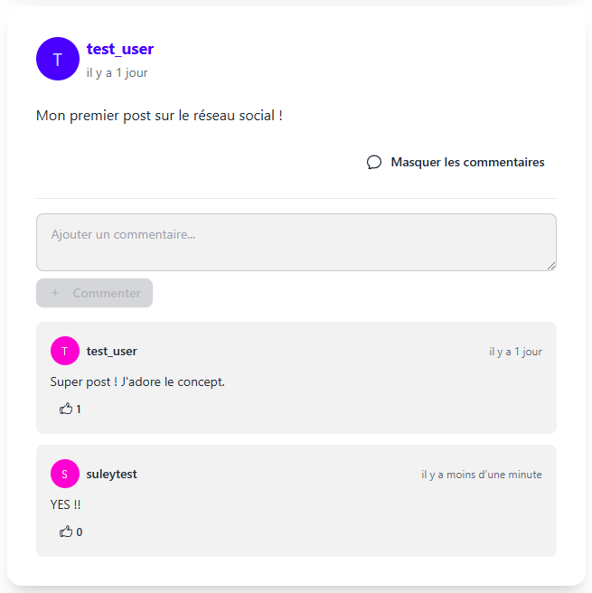
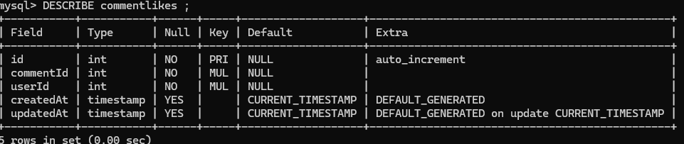

# Projet BTS SIO 1

## Introduction

NewVote est une application de réseau social permettant aux utilisateurs de partager des posts, commenter et interagir avec la communauté. Ce compte rendu technique détaille les choix technologiques et l'implémentation des différentes fonctionnalités.

## Stack Technologique


- **Backend** : Express.js (Node.js)

  - Framework web minimaliste et flexible
  - Facilite la création d'API RESTful
  - Middleware system pour la gestion des requêtes

- **Frontend** : Next.js avec React et TypeScript

  - Framework React avec rendu côté serveur (SSR)
  - TypeScript pour un typage statique et une meilleure maintenabilité
  - Système de routing intégré

- **Base de données** : MySQL avec Sequelize ORM

  - Base de données relationnelle robuste
  - ORM pour une manipulation simplifiée des données
  - Migrations et modèles structurés

- **UI/UX** : DaisyUI et Tailwind CSS

  - Framework CSS utilitaire
  - Composants préconçus et personnalisables
  - Design system cohérent

- **Authentification** : JWT (JSON Web Tokens)
  - Authentification sans état (stateless)
  - Sécurité basée sur les tokens
  - Gestion des sessions côté client

## Établir la Problématique

### Problématique

Comment permettre aux utilisateurs de partager leurs dilemmes ou questions et recevoir des propositions de la part de la communauté de manière efficace et intuitive ?

## Cahier des Charges

### Fonctionnalités

1. **Inscription et Connexion des Utilisateurs**

   - Les utilisateurs doivent pouvoir s'inscrire et se connecter à l'application via un formulaire dédié. Ce formulaire doit être simple et intuitif, demandant des informations de base telles que le nom d'utilisateur et le mot de passe.

2. **Création de Posts**

   - Une fois connectés, les utilisateurs peuvent créer des posts en fournissant un titre et une description. Cette fonctionnalité doit être accessible via un bouton clairement visible sur la page d'accueil ou la page des posts.

3. **Affichage des Posts**

   - Tous les posts créés par les utilisateurs sont affichés sur une page dédiée. Les posts doivent être triés par date de création, du plus récent au plus ancien, pour que les utilisateurs puissent facilement voir les nouvelles publications.

4. **Détail d'un Post**

   - En cliquant sur un post, les utilisateurs peuvent voir les détails du post, y compris les propositions faites par la communauté et les votes associés à chaque proposition.

5. **Propositions et Votes**

   - Les utilisateurs peuvent proposer des solutions ou des suggestions pour un post. Chaque proposition peut être votée par les autres utilisateurs, permettant ainsi de mettre en avant les meilleures idées.

6. **Gestion des Utilisateurs et des Posts (Admin)**

   - Un onglet administrateur permettra de gérer les utilisateurs et les posts de l'application. Les administrateurs pourront supprimer des posts inappropriés et gérer les comptes utilisateurs.

### Diagramme de Cas d'Utilisation

- Cas d'utilisation pour l'utilisateur:


- Cas d'utilisation pour l'administrateur:


#### Catégories/Types d'Utilisateurs

1. **Utilisateur**

   - Inscription
   - Connexion
   - Création de posts
   - Consultation des posts
   - Proposition de solutions
   - Vote pour les propositions

2. **Administrateur**

   - Gestion des utilisateurs
   - Gestion des posts
   - Consultation des statistiques des posts

## Charte Graphique et UI Kit

## Wireframe


### Charte Graphique

1. **Couleurs Principales**

   - **Couleur primaire** : #570DF8 (violet vif)
   - **Couleur secondaire** : #F000B8 (rose vif)
   - **Couleur de fond** : #F8F9FA (gris très clair)
   - **Couleur de texte** : #1F2937 (gris foncé)
   - **Couleur d'accentuation** : #37CDBE (turquoise)
   - **Couleur d'erreur** : #FF0000 (rouge)
   - **Couleur de succès** : #36D399 (vert)

2. **Typographie**

   - **Police principale** : Inter, system-ui, sans-serif
   - **Tailles de texte** :
     - Titres principaux : 2.25rem (36px)
     - Sous-titres : 1.5rem (24px)
     - Texte courant : 1rem (16px)
     - Texte secondaire : 0.875rem (14px)
   - **Poids des polices** :
     - Titres : 700 (bold)
     - Sous-titres : 600 (semi-bold)
     - Texte courant : 400 (regular)

3. **Structure du Style**

   - **Global**

     - Utilisation de DaisyUI et Tailwind CSS pour une gestion cohérente des styles
     - Thème light par défaut avec option de thème dark
     - Espacement vertical de 1.5rem entre les sections
     - Marges latérales responsives (1rem sur mobile, 2rem sur desktop)

   - **Composants**

     - **Cartes (Cards)**

       

     - **Boutons**

       

       

       - Boutons primaires : fond violet (#570DF8)
       - Boutons secondaires : fond rose (#F000B8)
       - Boutons fantômes : transparent avec bordure
       - Padding : 0.5rem 1rem
       - Border-radius : 0.5rem

     - **Formulaires**

       

4. **Éléments d'Interface**

   - **Navigation**

     - Barre de navigation fixe en haut
     - Fond blanc avec ombre légère
     - Logo à gauche
     - Menu de navigation à droite

   - **Posts**

     - Carte blanche avec ombre
     - Avatar de l'utilisateur rond
     - Contenu principal avec espacement
     - Actions (like, commentaire) en bas

   - **Commentaires**

     - Indentation pour la hiérarchie
     - Fond légèrement grisé
     - Avatar plus petit que les posts

## Planification de la Réalisation

### Planification des Tâches


## Plan de Développement - Application de Réseau Social

## Phase 1 : Configuration Initiale

1. **Mise en place de l'environnement de développement**

   - Installation des outils nécessaires (Node.js, MySQL, Git)
   - Création du repository Git
   - Configuration des éditeurs et des linters

2. **Structure du projet**
   - Initialisation du projet back-end (Express)
   - Initialisation du projet front-end (React)
   - Configuration de base des deux projets

## Phase 2 : Back-end Base

1. **Configuration de la base de données**

   - Création des migrations MySQL
   - Mise en place des modèles de données
   - Configuration de la connexion à la base de données

2. **Authentification**

   - Implémentation du système de hachage avec bcrypt
   - Mise en place de JWT
   - Création des routes d'authentification (inscription, connexion, déconnexion)

3. **Structure MVC**
   - Mise en place des contrôleurs
   - Création des services
   - Configuration des middlewares

## Phase 3 : Back-end Fonctionnalités

1. **Gestion des posts**

   - CRUD complet pour les posts
   - Système de validation
   - Gestion des erreurs

2. **Gestion des commentaires**

   - CRUD pour les commentaires
   - Système de likes
   - Tri par popularité

3. **Gestion administrative**
   - Système de rôles
   - Routes administrateur
   - Sécurisation des routes sensibles

## Phase 4 : Front-end Base

1. **Configuration React**

   - Mise en place de React Router
   - Configuration de React Query/Axios
   - Mise en place du Context API

2. **Components de base**
   - Layout principal
   - Navigation
   - Composants réutilisables

## Phase 5 : Front-end Pages

1. **Authentification**

   - Page de connexion
   - Page d'inscription
   - Gestion des formulaires

2. **Pages principales**

   - Page d'accueil
   - Page de profil
   - Panneau administrateur

3. **Fonctionnalités**
   - Création/édition de posts
   - Système de commentaires
   - Gestion des likes

## Phase 6 : Finalisation

1. **Tests**

   - Tests unitaires back-end
   - Tests d'intégration
   - Tests front-end

2. **Optimisation**

   - Performance back-end
   - Performance front-end
   - Sécurité

3. **Déploiement**
   - Configuration serveur
   - Mise en production
   - Documentation

### Schéma de la Base de Données

Les tables de la base de données sont les suivantes :


## Dictionnaire de Données




## Documentation Technique

### Système d'Authentification

#### Vue d'ensemble

L'authentification dans NewVote utilise les JSON Web Tokens (JWT). Voici comment cela fonctionne étape par étape :

1. **Inscription** : L'utilisateur crée un compte

2. **Connexion** : L'utilisateur reçoit un token JWT
3. **Requêtes** : Le token est envoyé dans chaque requête
4. **Vérification** : Le backend valide le token

### Implémentation Détaillée

#### 1. Inscription (`authController.js`)

```javascript
exports.register = async (req, res) => {
  try {
    const { username, email, password } = req.body;

    // 1. Hashage du mot de passe avec bcrypt
    const salt = await bcrypt.genSalt(10);
    const hashedPassword = await bcrypt.hash(password, salt);

    // 2. Création de l'utilisateur dans la base de données
    const [result] = await sequelize.query(
      "INSERT INTO Users (username, email, password, role, createdAt, updatedAt) VALUES (:username, :email, :password, :role, NOW(), NOW())",
      {
        replacements: {
          username,
          email,
          password: hashedPassword, // Mot de passe hashé
          role: "user",
        },
        type: sequelize.QueryTypes.INSERT,
      }
    );

    // 3. Génération du token JWT
    const token = jwt.sign(
      { id: result, role: "user" },
      process.env.JWT_SECRET,
      { expiresIn: "24h" }
    );

    res.status(201).json({
      success: true,
      token,
      user: { id: result, username, email, role: "user" },
    });
  } catch (error) {
    res.status(500).json({
      success: false,
      message: "Erreur lors de l'inscription",
    });
  }
};
```

Explications :

- `bcrypt.genSalt(10)` : Crée un "sel" aléatoire pour renforcer le hashage
- `bcrypt.hash()` : Transforme le mot de passe en une chaîne sécurisée
- `jwt.sign()` : Crée un token contenant les informations de l'utilisateur

#### 2. Middleware de Protection (`auth.js`)

```javascript
exports.protect = async (req, res, next) => {
  try {
    // 1. Extraction du token du header
    const token = req.headers.authorization?.split(" ")[1];
    if (!token) {
      return res.status(401).json({
        message: "Authentification requise",
      });
    }

    // 2. Vérification du token
    const decoded = jwt.verify(token, process.env.JWT_SECRET);

    // 3. Vérification de l'existence de l'utilisateur
    const [user] = await sequelize.query(
      "SELECT id, username, email, role FROM Users WHERE id = :id",
      {
        replacements: { id: decoded.id },
        type: sequelize.QueryTypes.SELECT,
      }
    );

    if (!user) {
      return res.status(401).json({
        message: "Utilisateur non trouvé",
      });
    }

    // 4. Ajout des informations utilisateur à la requête
    req.user = user;
    next();
  } catch (error) {
    res.status(401).json({
      message: "Token invalide",
    });
  }
};
```

Explications :

- Le middleware intercepte chaque requête protégée
- Il vérifie la présence et la validité du token
- Il attache les informations de l'utilisateur à la requête

#### 3. Utilisation côté Frontend

```typescript
// Configuration Axios avec Intercepteur
api.interceptors.request.use((config) => {
  const token = localStorage.getItem("token");
  if (token) {
    config.headers.Authorization = `Bearer ${token}`;
  }
  return config;
});

// Exemple de connexion
const handleLogin = async (credentials) => {
  try {
    const response = await api.post("/auth/login", credentials);
    const { token, user } = response.data;

    // Stockage du token
    localStorage.setItem("token", token);

    // Redirection
    router.push("/feed");
  } catch (error) {
    setError("Erreur de connexion");
  }
};
```

Explications :

- Le token est stocké dans le localStorage après connexion
- L'intercepteur Axios ajoute automatiquement le token aux requêtes
- Le format "Bearer" est le standard pour l'authentification JWT

[Image à ajouter : Diagramme de séquence montrant le flux d'authentification]

### Sécurité

Plusieurs mesures de sécurité sont mises en place :

1. Hashage des mots de passe avec bcrypt
2. Tokens JWT avec expiration
3. Validation des données côté serveur
4. Protection CSRF avec les tokens
5. Headers de sécurité HTTP

## Backend (Express.js)

### Configuration et Structure

Le backend est structuré selon le pattern MVC (Model-View-Controller) :

```
backend/
├── src/
│   ├── config/
│   ├── controllers/
│   ├── models/
│   ├── routes/
│   ├── middlewares/
│   └── server.js
```

### Exemple Détaillé : Gestion des Posts

Prenons l'exemple de la création d'un post pour illustrer le fonctionnement du backend.

1. **Route** (`routes/postRoutes.js`) :

```javascript
router.post("/", protect, postController.createPost);
```

2. **Controller** (`controllers/postController.js`) :

```javascript
exports.createPost = async (req, res) => {
  try {
    const { content } = req.body;
    const userId = req.user.id;

    const [result] = await sequelize.query(
      "INSERT INTO Posts (content, userId, createdAt, updatedAt) VALUES (:content, :userId, NOW(), NOW())",
      {
        replacements: { content, userId },
        type: sequelize.QueryTypes.INSERT,
      }
    );

    // Récupération du post créé
    const [post] = await sequelize.query(
      `SELECT p.*, u.username 
       FROM Posts p 
       JOIN Users u ON p.userId = u.id 
       WHERE p.id = :postId`,
      {
        replacements: { postId: result },
        type: sequelize.QueryTypes.SELECT,
      }
    );

    res.status(201).json({
      success: true,
      message: "Post créé avec succès",
      post,
    });
  } catch (error) {
    res.status(500).json({
      success: false,
      message: "Erreur lors de la création du post",
    });
  }
};
```

### Tests API avec Insomnia

Pour tester nos endpoints, nous utilisons Insomnia. Voici un exemple de test pour la création d'un post :

[Image à ajouter : Capture d'écran Insomnia montrant :

1. La requête POST vers /api/posts
2. Le header Authorization avec le token JWT
3. Le body de la requête avec le contenu du post
4. La réponse du serveur]

### Connexion à la Base de Données

La connexion à MySQL est gérée via Sequelize (`config/database.js`) :

```javascript
const sequelize = new Sequelize(
  process.env.DB_NAME,
  process.env.DB_USER,
  process.env.DB_PASSWORD,
  {
    host: process.env.DB_HOST,
    dialect: "mysql",
    logging: process.env.NODE_ENV === "development" ? console.log : false,
  }
);
```

[Image à ajouter : Capture d'écran de MySQL Workbench montrant la structure de la table Posts]

## Frontend (Next.js)

### Communication avec le Backend

Le frontend utilise Axios pour communiquer avec le backend. Prenons l'exemple du feed de posts pour illustrer cette communication.

1. **Configuration Axios** (`src/lib/axios.ts`) :

```typescript
const api = axios.create({
  baseURL: process.env.NEXT_PUBLIC_API_URL || "http://localhost:3000/api",
  headers: {
    "Content-Type": "application/json",
  },
});

api.interceptors.request.use((config) => {
  const token = localStorage.getItem("token");
  if (token) {
    config.headers.Authorization = `Bearer ${token}`;
  }
  return config;
});
```

2. **Composant Feed** (`app/feed/page.tsx`) :

```typescript
const [posts, setPosts] = useState<Post[]>([]);

useEffect(() => {
  const fetchPosts = async () => {
    try {
      const response = await api.get("/posts");
      setPosts(response.data.posts);
    } catch (error) {
      setError("Erreur lors du chargement des posts");
    }
  };

  fetchPosts();
}, []);
```

[Image à ajouter : Capture d'écran du feed montrant :

1. L'interface utilisateur avec les posts
2. Les outils de développement Chrome avec l'onglet Network
3. La requête API et sa réponse]

### Gestion de l'État et Rendu

Le composant Post illustre la gestion de l'état local et le rendu conditionnel :

```typescript
const [showComments, setShowComments] = useState(false);
const [comments, setComments] = useState<Comment[]>([]);

// Chargement des commentaires à la demande
const handleShowComments = async () => {
  if (!showComments) {
    await fetchComments();
  }
  setShowComments(!showComments);
};
```

[Image à ajouter : Capture d'écran montrant l'interaction utilisateur :

1. État initial du post
2. Affichage des commentaires après clic
3. Formulaire d'ajout de commentaire]

## Conclusion

L'architecture choisie permet une séparation claire des responsabilités :

- Le backend gère la logique métier et les données
- Le frontend se concentre sur l'interface utilisateur et l'expérience utilisateur
- La base de données assure la persistance des données

Les points forts de l'application :

- Architecture modulaire et maintenable
- Sécurité avec JWT et middleware d'authentification
- Interface utilisateur réactive et moderne avec DaisyUI
- API RESTful bien structurée

Axes d'amélioration potentiels :

- Mise en place de tests automatisés
- Optimisation des performances avec la mise en cache
- Déploiement avec Docker pour faciliter la mise en production
