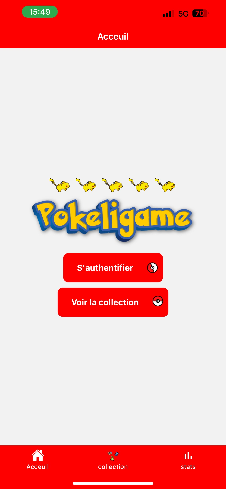
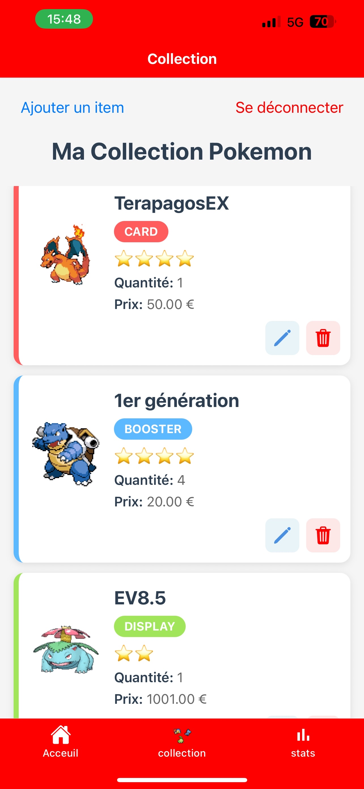
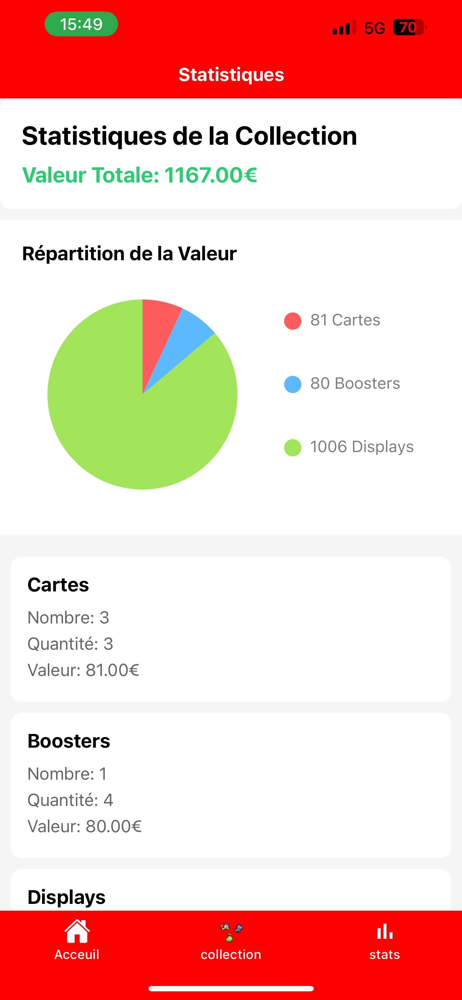
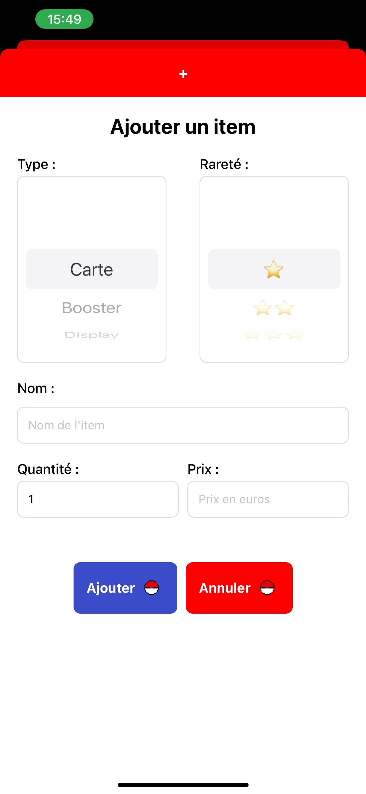

# Documentation PokeLigame


## 1. Introduction

### Présentation du Projet

**Pokeligame** est une application mobile de gestion de collection de cartes de booster et de display Pokémon. Cette application permet aux utilisateurs de suivre leur collection personnelle de cartes de booster et de display, tout en évaluant la valeur totale de leur collection. L'utilisateur peut mettre à jour les prix et les quantités de ses items au fur et à mesure.






### Stack Technologique


- **Backend**: `Flask` (Python)
- **Frontend**: `React Native`
- **Base de données**: `MySQL`
- **Outils de développement**:
  - `Insomnia` pour les tests d'API
  - `Git` pour la gestion de version

### Problématique

La gestion d'une collection de cartes de booster et de display Pokémon peut devenir complexe avec le temps, notamment en ce qui concerne :

> - Le suivi de la valeur de la collection
> - La mise à jour des prix et des quantités
> - Complexité pour accéder à sa collection de partout
> - La sécurité des données utilisateur

## 2. Cahier des Charges

### Description des Fonctionnalités

1. **Gestion des Utilisateurs**

- Inscription et connexion
- Profil utilisateur
- Sécurité des données

2. **Gestion de la Collection**

- Ajout de cartes à la collection
- Ajout de booster à la collection
- Ajout de displays à la collection
- Suivi des quantités possédées
- Catégorisation par rareté
- Mise à jour des prix
- Évaluation de la valeur totale

3. **Gestion des Items**

- Gestion unifiée des cartes de booster et displays
- Mise à jour des prix et quantités

### Diagramme de Cas d'Utilisation


### Charte Graphique et UI Kit

#### **Palette de couleurs**

- **Couleur principale**: `#FF0000` (Rouge Pokémon)
- **Couleurs secondaires**:
  - `#3B4CCA` (Bleu Pokémon)
  - `#2ecc71` (Vert pour les valeurs)
  - `#2c3e50` (Bleu foncé pour les textes)
- **Couleurs d'accent**:
  - `#FF5D5D` (Rouge clair pour les cartes)
  - `#5DB9FF` (Bleu clair pour les boosters)
  - `#A1E65A` (Vert clair pour les displays)
  - `#f1c40f` (Jaune pour les étoiles de rareté)
- **Couleurs de fond**:
  - `#ffffff` (Blanc pour les cartes et fonds)
  - `#f5f5f5` (Gris très clair pour les fonds de page)
- **Couleurs de texte**:
  - `#666` (Gris pour les textes secondaires)
  - `#7F7F7F` (Gris pour les légendes)

#### **Typographie**

- **Titres**:
  - Taille: `24-28px`
  - Police: Système par défaut
  - Style: **Bold**
- **Corps de texte**:
  - Taille: `16px`
  - Police: Système par défaut
  - Style: Regular
- **Boutons et actions**:
  - Taille: `16px`
  - Police: Système par défaut
  - Style: **Bold**

#### **Composants UI**

- **Boutons**:
  - Fond rouge (`#FF0000`) pour les actions principales
  - Fond bleu (`#3B4CCA`) pour les actions de soumission
  - Texte blanc
  - Coins arrondis (`8-10px`)
- **Cartes**:
  - Fond blanc
  - Ombre portée légère
  - Coins arrondis (`12px`)
  - Bordure colorée selon le type d'item
- **Formulaires**:
  - Champs avec bordure grise (`#ddd`)
  - Coins arrondis (`8px`)
  - Espacement interne de `12px`
- **Navigation**:
  - Barre de navigation rouge (`#FF0000`)
  - Icônes et texte en blanc
  - Onglets avec texte noir

### Plan de Développement

1. **Phase 1: Mise en place de l'infrastructure**

- Mise en place de la base de données
- Configuration du backend Flask
- Configuration du frontend React Native

2. **Phase 2: Développement Backend**

- Création des routes API
- Implémentation de la logique métier
- Tests avec Insomnia

3. **Phase 3: Développement Frontend**

- Création des composants UI
- Intégration des API
- Tests utilisateur


## 3. Base de Données

> La structure de la base de données a été conçue pour répondre aux besoins spécifiques de la gestion d'une collection de cartes Pokémon. Le choix de MySQL s'est imposé pour sa robustesse et sa facilité d'utilisation. La séparation en trois tables distinctes (cards, boosters, displays) permet une gestion claire et efficace des différents types d'items, tout en maintenant une cohérence dans la structure des données. Cette architecture facilite les requêtes complexes et permet une évolution future de l'application.

### Dictionnaire de Données

### **Table Users**

- `id` (INT, PK)
- `email` (VARCHAR, UNIQUE)
- `password` (VARCHAR)
- `username` (VARCHAR)
- `date_creation` (DATETIME)

### **Table Cards**

- `id` (INT, PK)
- `name` (VARCHAR)
- `rarity` (INT)
- `quantity` (INT)
- `price` (FLOAT)
- `user_id` (INT, FK)

### **Table Boosters**

- `id` (INT, PK)
- `user_id` (INT, FK)
- `name` (VARCHAR)
- `quantity` (INT)
- `price` (DECIMAL)
- `rarity` (INT)

### **Table Displays**

- `id` (INT, PK)
- `user_id` (INT, FK)
- `name` (VARCHAR)
- `quantity` (INT)
- `price` (DECIMAL)
- `rarity` (INT)

### Schéma de la Base de Données


## 4. Backend et Fonctionnalités

> Le backend a été développé avec Flask pour sa simplicité et sa flexibilité. Cette approche permet une mise en place rapide des fonctionnalités tout en maintenant une structure claire et maintenable. L'utilisation de JWT pour l'authentification assure une sécurité robuste, tandis que la séparation des routes en modules distincts (auth.py et items.py) facilite la maintenance et l'évolution du code. L'API RESTful permet une communication efficace entre le frontend et le backend, avec une gestion appropriée des erreurs et des validations.

### Architecture Backend

```
backend/
├── app/
│   ├── __init__.py           # Initialisation de l'application Flask
│   ├── routes/               # Routes de l'API
│   │   ├── auth.py          # Routes d'authentification
│   │   └── items.py         # Routes pour les cartes, boosters et displays
│   └── config/              # Configuration
│       └── config.py        # Paramètres de configuration
├── run.py                   # Point d'entrée de l'application
└── requirements.txt         # Dépendances Python
```

### Exemples de Code Backend

### **Récupération des Items** (routes/items.py)

```python
@items_bp.route("/items", methods=["GET"])
@jwt_required()
def get_items():
    current_user_id = int(get_jwt_identity())
    cur = mysql.connection.cursor()

    # Récupération des cartes
    cur.execute(
        "SELECT 'card' as type, id, name, rarity, quantity, price FROM cards WHERE user_id = %s",
        [current_user_id],
    )
    cards = cur.fetchall()

    # Récupération des boosters
    cur.execute(
        "SELECT 'booster' as type, id, name, rarity, quantity, price FROM boosters WHERE user_id = %s",
        [current_user_id],
    )
    boosters = cur.fetchall()

    # Récupération des displays
    cur.execute(
        "SELECT 'display' as type, id, name, rarity, quantity, price FROM displays WHERE user_id = %s",
        [current_user_id],
    )
    displays = cur.fetchall()

    # Combinaison des résultats
    all_items = cards + boosters + displays

    # Formatage des résultats
    result = [
        {
            "type": item[0],
            "id": item[1],
            "name": item[2],
            "rarity": item[3],
            "quantity": item[4],
            "price": item[5],
        }
        for item in all_items
    ]

    return jsonify(result)
```

**Description** :
Cette route permet de récupérer tous les items (cartes, boosters et displays) d'un utilisateur. Elle :

- Vérifie l'authentification avec `@jwt_required()`
- Récupère l'ID de l'utilisateur connecté
- Fait trois requêtes SQL distinctes pour chaque type d'item
- Combine les résultats en un seul format unifié
- Retourne les données au format JSON

### **Création d'un Item** (routes/items.py)

```python
@items_bp.route("/items", methods=["POST"])
@jwt_required()
def create_item():
    current_user_id = int(get_jwt_identity())
    data = request.get_json()

    required_fields = ["type", "name", "rarity", "quantity", "price"]
    if not all(k in data for k in required_fields):
        return jsonify({"error": "Données manquantes"}), 400

    if data["type"] not in ["card", "booster", "display"]:
        return jsonify({"error": "Type d'item invalide"}), 400

    try:
        rarity = int(data["rarity"])
        quantity = int(data["quantity"])
        price = float(data["price"])

        if not 1 <= rarity <= 4:
            return jsonify({"error": "Rareté invalide (doit être entre 1 et 4)"}), 400

        cur = mysql.connection.cursor()
        table_name = data["type"] + "s"

        cur.execute(
            f"INSERT INTO {table_name} (user_id, name, rarity, quantity, price) VALUES (%s, %s, %s, %s, %s)",
            [current_user_id, data["name"], rarity, quantity, price],
        )
        mysql.connection.commit()

        return jsonify({
            "message": f'{data["type"]} ajouté avec succès',
            "item": {
                "type": data["type"],
                "name": data["name"],
                "rarity": rarity,
                "quantity": quantity,
                "price": price,
            },
        }), 201

    except ValueError:
        return jsonify({"error": "Valeurs numériques invalides"}), 400
    except Exception as e:
        return jsonify({"error": f"Erreur lors de la création : {str(e)}"}), 500
```

**Description** :
Cette route permet d'ajouter un nouvel item à la collection. Elle :

- Valide les données requises
- Vérifie le type d'item (carte, booster ou display)
- Convertit et valide les valeurs numériques
- Insère les données dans la table appropriée
- Gère les erreurs potentielles
- Retourne les données de l'item créé

### **Calcul de la Valeur Totale** (routes/items.py)

```python
@items_bp.route("/collection/total", methods=["GET"])
@jwt_required()
def get_collection_total():
    current_user_id = int(get_jwt_identity())
    cur = mysql.connection.cursor()

    try:
        # Calcul du total pour les cartes
        cur.execute(
            "SELECT COUNT(*) as count, SUM(quantity) as total_quantity, COALESCE(SUM(price * quantity), 0) as total_value FROM cards WHERE user_id = %s",
            [current_user_id],
        )
        cards_result = cur.fetchone()

        # Calcul du total pour les boosters
        cur.execute(
            "SELECT COUNT(*) as count, SUM(quantity) as total_quantity, COALESCE(SUM(price * quantity), 0) as total_value FROM boosters WHERE user_id = %s",
            [current_user_id],
        )
        boosters_result = cur.fetchone()

        # Calcul du total pour les displays
        cur.execute(
            "SELECT COUNT(*) as count, SUM(quantity) as total_quantity, COALESCE(SUM(price * quantity), 0) as total_value FROM displays WHERE user_id = %s",
            [current_user_id],
        )
        displays_result = cur.fetchone()

        # Formatage des résultats
        result = {
            "cards": {
                "count": int(cards_result[0] or 0),
                "quantity": int(cards_result[1] or 0),
                "value": float(cards_result[2]),
            },
            "boosters": {
                "count": int(boosters_result[0] or 0),
                "quantity": int(boosters_result[1] or 0),
                "value": float(boosters_result[2]),
            },
            "displays": {
                "count": int(displays_result[0] or 0),
                "quantity": int(displays_result[1] or 0),
                "value": float(displays_result[2]),
            },
            "total_value": float(cards_result[2]) + float(boosters_result[2]) + float(displays_result[2]),
        }

        return jsonify(result)

    except Exception as e:
        return jsonify({"error": str(e)}), 500
```

**Description** :
Cette route calcule la valeur totale de la collection. Elle :

- Récupère le nombre d'items, la quantité totale et la valeur pour chaque type
- Utilise `COALESCE` pour gérer les valeurs NULL
- Combine les résultats en un objet structuré
- Calcule la valeur totale de la collection
- Gère les erreurs potentielles

### Tests avec Insomnia


### Fonctionnalités Backend

### Authentification

- **Inscription** (`/api/register`)
  - Validation des données
  - Vérification d'email unique
  - Hashage du mot de passe
- **Connexion** (`/api/login`)
  - Génération de token JWT
  - Vérification des identifiants
- **Déconnexion** (`/api/logout`)

### Gestion de la Collection

- **Récupération de tous les items** (`/api/items`)
  - Liste unifiée des cartes de booster et displays
  - Filtrage par type (cartas de booster, displays)
  - Tri par rareté et valeur
- **Ajout d'item** (`/api/items`)
  - Validation du type d'item (carte de booster ou display)
  - Validation de la rareté (1-4)
  - Gestion des quantités possédées
  - Prix de l'item
- **Mise à jour d'item** (`/api/items/<type>/<id>`)
  - Modification des quantités
  - Mise à jour des prix
  - Validation des données
- **Suppression d'item** (`/api/items/<type>/<id>`)
- **Calcul de la valeur totale** (`/api/collection/total`)
  - Valeur par type d'item (cartas de booster, displays)
  - Total général de la collection
  - Quantités et compteurs

### Sécurité

- Authentification JWT
- Protection des routes
- Validation des données
- Gestion des erreurs

## 5. Frontend

> Le frontend a été développé avec React Native pour permettre le développement d'une application mobile cross-platform. Ce choix offre plusieurs avantages : une seule base de code pour iOS et Android, une large communauté et une excellente performance. L'utilisation de TypeScript ajoute une couche de sécurité au développement, tandis que l'architecture modulaire (composants, contextes, utilitaires) facilite la maintenance et la réutilisation du code. L'interface utilisateur a été conçue pour être intuitive et responsive, avec une attention particulière portée à l'expérience utilisateur.

### Architecture Frontend

```
frontend/
├── app/
│   ├── (tabs)/              # Navigation principale
│   │   ├── index.tsx        # Page d'accueil
│   │   ├── collection.tsx   # Gestion de la collection
│   │   ├── stats.tsx        # Statistiques
│   │   └── _layout.tsx      # Configuration des onglets
│   ├── (auth)/              # Routes d'authentification
│   ├── components/          # Composants réutilisables
│   ├── context/             # Contextes React
│   ├── animations/          # Animations personnalisées
│   ├── utils/               # Utilitaires
│   ├── _layout.tsx          # Layout principal
│   ├── auth-modal.tsx       # Modal d'authentification
│   └── modal.tsx            # Modal générique
├── assets/                  # Ressources statiques
├── app.json                 # Configuration Expo
├── package.json            # Dépendances Node.js
└── tsconfig.json          # Configuration TypeScript
```

### WIREFRAME


### Exemples de Code Frontend

### Configuration de l'API (app/services/api.ts)

```typescript
import axios from "axios";

const API_URL = "http://localhost:5000/api";

const api = axios.create({
  baseURL: API_URL,
  headers: {
    "Content-Type": "application/json",
  },
});

// Intercepteur pour ajouter le token d'authentification
api.interceptors.request.use((config) => {
  const token = localStorage.getItem("token");
  if (token) {
    config.headers.Authorization = `Bearer ${token}`;
  }
  return config;
});

export default api;
```

**Configuration d'Axios montrant** :

- Création d'une instance API
- Gestion automatique du token d'authentification

### Composant de Carte (components/CardItem.tsx)

```typescript
const CardItem = ({ item, onEdit, onDelete }: CardItemProps) => {
  const typeColor = getTypeColor(item.type);

  return (
    <View style={[styles.card, { borderLeftColor: typeColor }]}>
      <View style={styles.cardContent}>
        <Image source={getTypeImage(item.type)} style={styles.cardImage} />
        <View style={styles.cardInfo}>
          <Text style={styles.cardName}>{item.name}</Text>
          <View style={[styles.typeContainer, { backgroundColor: typeColor }]}>
            <Text style={styles.typeText}>{item.type.toUpperCase()}</Text>
          </View>
          <Text style={styles.cardRarity}>{"⭐".repeat(item.rarity)}</Text>
        </View>
      </View>
    </View>
  );
};
```

**Exemple de composant React Native montrant** :

- Affichage conditionnel des couleurs selon le type
- Structure de carte avec image et informations
- Affichage de la rareté avec étoiles

### Styles de Carte (components/CardItem.tsx)

```typescript
const styles = StyleSheet.create({
  card: {
    padding: 16,
    backgroundColor: "#FFFFFF",
    marginBottom: 12,
    borderRadius: 12,
    shadowColor: "#000",
    shadowOffset: { width: 0, height: 2 },
    shadowOpacity: 0.1,
    shadowRadius: 4,
    elevation: 3,
  },
  cardContent: {
    flexDirection: "row",
    alignItems: "center",
  },
  typeContainer: {
    paddingHorizontal: 12,
    paddingVertical: 4,
    borderRadius: 20,
    alignSelf: "flex-start",
  },
});
```

**Exemple de styles montrant** :

- Design de carte avec ombre et coins arrondis
- Mise en page flexible avec Flexbox
- Style du badge de type

### Récupération des Données

- Utilisation d'Axios pour les requêtes HTTP
- Gestion des états avec React Hooks
- Gestion des erreurs et des états de chargement

### Exemple de Récupération (collection.tsx)

```typescript
export default function Collection() {
  const { token, isAuthenticated } = useAuth();
  const [cards, setCards] = useState<Card[]>([]);
  const [isLoading, setIsLoading] = useState(true);

  useEffect(() => {
    if (!isAuthenticated && !isLoading) {
      router.replace("/auth-modal");
      return;
    }

    if (isAuthenticated) {
      axios
        .get(`${getApiUrl()}/items`, {
          headers: {
            Authorization: `Bearer ${token}`,
          },
        })
        .then((response) => setCards(response.data))
        .catch((error) =>
          console.error("Erreur lors de la récupération des cartes :", error)
        )
        .finally(() => setIsLoading(false));
    }
  }, [isAuthenticated, token]);

  return (
    <View style={styles.container}>
      <FlatList
        data={cards}
        keyExtractor={(item) => `${item.type}-${item.id}`}
        renderItem={({ item }) => (
          <CardItem item={item} onEdit={handleEdit} onDelete={deleteItem} />
        )}
        contentContainerStyle={{ paddingHorizontal: 16 }}
        showsVerticalScrollIndicator={false}
      />
    </View>
  );
}
```

**Description détaillée du code** :

1. **Gestion des états** :

   - `token` et `isAuthenticated` : Récupérés depuis le contexte d'authentification
   - `cards` : Tableau pour stocker les items de la collection
   - `isLoading` : État pour gérer l'affichage du chargement

2. **Hook useEffect** :

   - S'exécute à chaque changement de `isAuthenticated` ou `token`
   - Vérifie si l'utilisateur est authentifié
   - Redirige vers la page d'authentification si non connecté
   - Fait la requête API uniquement si authentifié

3. **Requête API** :

   - Utilise Axios pour faire une requête GET vers `/items`
   - Ajoute le token d'authentification dans les headers
   - Met à jour l'état `cards` avec les données reçues
   - Gère les erreurs dans le `.catch()`
   - Met à jour `isLoading` une fois terminé

4. **Affichage** :
   - Utilise `FlatList` pour un affichage optimisé des items
   - Clé unique combinant le type et l'ID de l'item
   - Utilise le composant `CardItem` pour afficher chaque item
   - Désactive la barre de défilement verticale pour un design plus épuré
   - Ajoute un padding horizontal pour l'espacement

### Fonctionnalités Frontend

### **Navigation**

- Système d'onglets pour la navigation principale
- Routes protégées pour l'authentification
- Modals pour les interactions utilisateur

### **Pages Principales**

1. **Accueil**

   - Vue d'ensemble de la collection de cartes de booster et displays
   - Valeur totale de la collection
   - Accès rapide aux fonctionnalités principales

2. **Collection**

   - Liste unifiée des cartes de booster et displays possédés
   - Filtrage par type (cartas de booster, displays) et rareté
   - Modification des quantités et prix
   - Ajout de nouveaux items à la collection

3. **Statistiques**
   - Valeur totale de la collection
   - Répartition par type d'item
   - Graphiques de la valeur
   - Évolution des prix

### **Composants UI**


- **Modals**
  - Authentification
  - Ajout d'item à la collection
  - Modification des quantités et prix
  - Confirmation des actions
- **Listes**
  - Affichage unifié des items de la collection
  - Filtres par type et rareté
  - Tri par valeur ou quantité
- **Formulaires**
  - Validation des données
  - Gestion des erreurs
  - Mise à jour des informations

### **Gestion d'État**

- Context API pour l'authentification

### **Animations**

- Utilisation de modal

## 6. Conclusion

PokeLigame est une application mobile qui répond à un besoin réel des collectionneurs Pokémon. En utilisant des technologies modernes comme React Native pour le frontend et Flask pour le backend, une solution complète et facile à utiliser.
