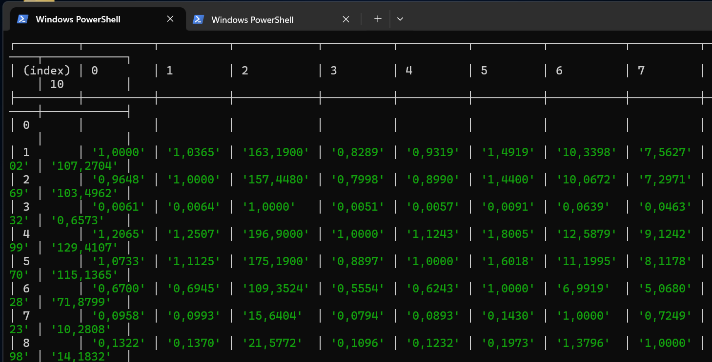
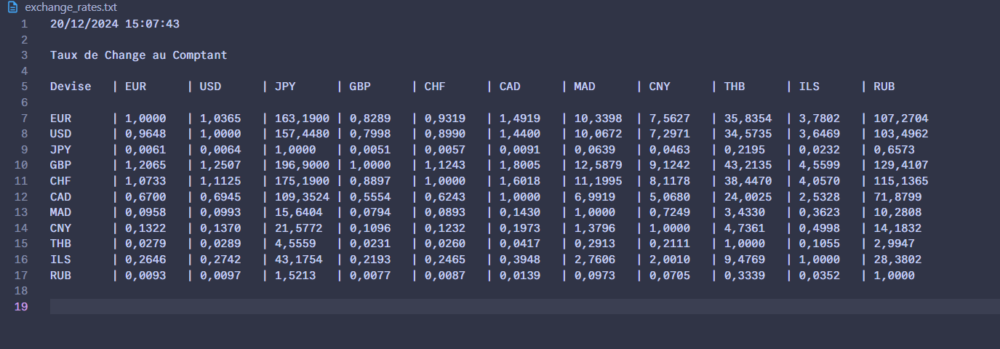

# Compte Rendu

## 1. Introduction

Je travaille dans une entreprise internationale qui a des filiales dans plusieurs pays. Pour les `comptables`,j'avais pour mission de retourner le taux de change dans différentes devises en `temps réel`.
Une fois l'information récupérée, je devais la `formater` et la mettre dans un fichier texte. Pour ensuite pouvoir l'intégrer dans l'`ERP` de l'entreprise.
Pas de restrictions de technologie, je pouvais faire comme je le souhaitais.

## 2. Solution

Je me suis donc renseigné sur les différentes technologies qui pouvaient m'aider à réaliser cette tâche.
J'ai vu qu'il y avait pas mal d'`API` déjà existantes pour `récupérer les taux de change`. Mais les API avaient, pour la plupart du temps, un `free trial limité`. C'était donc une solution `payante`.
J'ai donc cherché une autre solution.
Je me suis rendu compte que je pouvais récupérer les taux de change en utilisant une sorte de "`scraping`" (ce n'est pas vraiment du scrapping) de la page web.

## 3. Technologies Utilisées

Pour ce projet, j'ai utilisé les technologies suivantes :

- **Node.js** : Environnement d'exécution JavaScript
- **Playwright** : Bibliothèque d'automatisation de navigateur web
- **fs** : Module Node.js natif pour la manipulation des fichiers
- **path** : Module Node.js natif pour la gestion des chemins de fichiers

## 4. Quelques images




## 5. Description du Script

Le script fonctionne de la manière suivante :

1. **Initialisation** :

   - Configuration de Playwright avec Chrome en mode headless
   - Configuration des chemins de fichiers
   - Définition des devises à surveiller (EUR, USD, JPY, GBP, CHF, etc.)

2. **Récupération des données** :

   - Connexion au site Boursorama (<https://www.boursorama.com/bourse/devises/taux-de-change/>)
   - Attente du chargement du tableau des taux
   - Extraction des données via les sélecteurs CSS

3. **Traitement des données** :

   - Formatage des taux de change en tableau
   - Ajout des en-têtes avec les devises
   - Alignement et mise en forme des données

4. **Export** :
   - Génération d'un fichier texte formaté (exchange_rates.txt)
   - Horodatage des données
   - Mise à jour automatique toutes les 2 minutes

## 5. Fonctionnement du Projet

Le projet s'exécute de manière automatisée avec les caractéristiques suivantes :

### 5.1 Automatisation

- Exécution automatique toutes les 2 minutes
- Mode headless (sans interface graphique)
- Surveillance continue des taux de change

### 5.2 Format de Sortie

- Fichier texte structuré (exchange_rates.txt)
- Format tabulaire avec alignement des colonnes
- Horodatage de chaque mise à jour

### 5.3 Maintenance

- Code modulaire et bien structuré
- Gestion des erreurs intégrée
- Configuration facile à modifier (devises, intervalles)

## Conclusion

Cette solution permet de :

- Réduire les coûts en évitant les API payantes
- Automatiser complètement le processus
- Garantir une mise à jour en temps réel des taux de change
- Faciliter l'intégration avec l'ERP existant

La solution est évolutive et peut être adaptée pour suivre d'autres devises ou modifier le format de sortie selon les besoins.

## 7. Extraits de Code Commentés

### 7.1 Initialisation et Imports

```javascript
// Import des modules nécessaires
const { chromium } = require("playwright"); // Pour l'automatisation du navigateur
const fs = require("fs"); // Pour la manipulation des fichiers
const path = require("path"); // Pour la gestion des chemins
```

### 7.2 Configuration des Devises

```javascript
// Configuration des en-têtes avec les devises suivies
const headers = [
  "EUR",
  "USD",
  "JPY",
  "GBP",
  "CHF",
  "CAD",
  "MAD",
  "CNY",
  "THB",
  "ILS",
  "RUB",
];

// Tableau complet des devises avec espace pour l'alignement
const currencies = [
  " ",
  "EUR",
  "USD",
  "JPY",
  "GBP",
  "CHF",
  "CAD",
  "MAD",
  "CNY",
  "THB",
  "ILS",
  "RUB",
];
```

### 7.3 Extraction des Données

```javascript
// Fonction principale de récupération des taux
const fetchExchangeRates = async () => {
  const browser = await chromium.launch({ headless: true });
  const page = await browser.newPage();

  // Navigation vers la page des taux de change
  await page.goto("https://www.boursorama.com/bourse/devises/taux-de-change/");
  await page.waitForSelector(".c-table__body");

  // Extraction des données du tableau
  const exchangeRates = await page.$$eval(".c-table__row", (rows) => {
    return rows.map((row) => {
      const cells = Array.from(row.querySelectorAll("td")).map((cell) =>
        cell.innerText.trim()
      );
      return cells;
    });
  });
};
```

### 7.4 Formatage et Export

```javascript
// Formatage des données en tableau aligné
const formattedExchangeRates = exchangeRates
  .map((row, index) =>
    [currencies[index], ...row]
      .map((cell) => (cell ? cell.padEnd(8) : " ".padEnd(8)))
      .join(" | ")
  )
  .join("\n");

// Création du contenu final avec horodatage
const formattedHeaders = ["Devise", ...headers]
  .map((h) => h.padEnd(8))
  .join(" | ");

const content = `${new Date().toLocaleString()}
\nTaux de Change au Comptant\n
${formattedHeaders}\n${formattedExchangeRates}\n\n`;

// Écriture dans le fichier
const filePath = path.join(__dirname, "exchange_rates.txt");
fs.writeFileSync(filePath, content);
```

### 7.5 Automatisation

```javascript
// Fonction de démarrage avec intervalle
const startFetching = async () => {
  await fetchExchangeRates(); // Première exécution
  setInterval(fetchExchangeRates, 120000); // Toutes les 2 minutes
};

// Lancement du programme
startFetching();
```

Ces extraits de code montrent les points clés de l'application :

- L'utilisation de Playwright pour l'automatisation du navigateur
- La structure de données pour les devises
- L'extraction et le formatage des données
- L'export dans un fichier texte
- L'automatisation avec des intervalles réguliers

Le code est organisé de manière modulaire, ce qui facilite sa maintenance et son évolution future.
