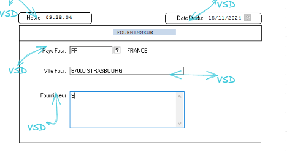
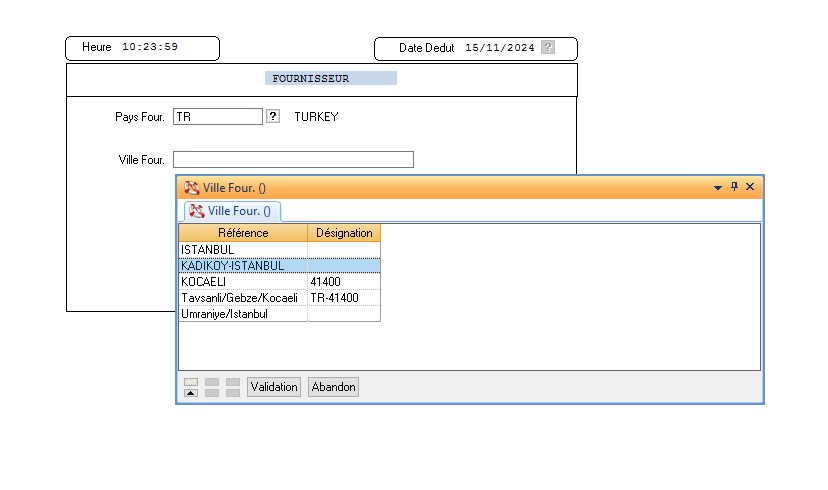

# TP DIAPASON

## DIAPASON

`Diapason` est un `ERP` développé par `ISIA` pour l’industrie manufacturière, écrit en Progress. Il est modulaire, centralise la gestion de production, des stocks, et des flux financiers, et offre des APIs pour l'intégration avec d’autres systèmes. Sa structure permet des `personnalisations` pour répondre aux besoins spécifiques des entreprises industrielles.

L'exercice vise à alimenter avec un critère un tableur `dynamique(TDY)` une liste chaînée de Fournisseurs (DTD = LAF = lien article fournisseur) une des tables de la base de données de DIAPASON.

- (FRONT) Pour cela, nous allons d'abord réaliser le formulaire(PSD) qui permettra de filtrer l'ensemble des fournisseurs de DIAPASON avec le pays et la ville.
  Ce formulaire va être sécurisé nous allons contrôler ceux que l'utilisateur saisie(CTL). Et nous allons guider l'utilisateur en ajoutant des aides en appuyant `F2` (AID).

- (BACKEND) Pour ensuite réaliser le le tableurs dynamique (TDY) qui permet l'affichage de données, la saisie de données, la suppression de donneés.
  Dans notre cas le (TDY) vas nous afficher le lien article fournisseur d'une table précise de diapason.
  Notre tableur contiendra 8 colonnes : Fournisseur, Article, Origin, Date Val, Prix unitaire, Un. Me., Prix Remisé.
  Va permettre de visualiser la liste **lien article-fournisseur** pour un fournisseur saisie en critère.

### Création de la Procédures de Saisie Dynamique (PSD)

_Pour créer une PSD il y'a plein d'étape dans les menus de DIAPASON au préalable que je ne vais pas mentionné ici._
Nous allons directement passé au code.

**1. Création des différents chamsp de la PSD.**

Les champs d'un PSD sont stocké dans des variable (VSD). Il faut donc créer 5 VSD dans notre cas :

- VSD heure du jour
- VSD Date du jour
- VSD Pays Fournisseur
- VSD Ville Fournisseur
- VSD Fournisseur
  Ce sont les champs que nous retrouvons dans la PSD
  Ensuite, création du front-end simplement pour l'affichage des VSD.
  
  _(Je ne rentre pas dans les détails de création de VSD)_

**2. Création des requetes.**

Une `PSD` est constituée de plusieurs requêtes appelées `requête PSD` dans notre cas notre PSD contient 2 requêtes. Une pour l'initialisation et l'autre pour le contrôle. Le nommage = nomdelarequete+I pour l'initialisation et nomdelarequete+L pour requête local qui vas effectuer les filtres ou les contrôles des champs de la PSD en **local**.
**!! NE PAS OUBLIEZ DE BRANCHER LES REQUETE A LA PSD!!**


**3. Requête d'initialisation.**
La requête vient simplement initailiser(préremplire) les champs = VSD de l'heure du jour et de la date du jour dès le lancement de la PSD.
**Ligne 9 et 10**

```
ligne9:VLO.Evenement = SCR.CdeSCCEvt #VLO = variable local Evenement stock l'evement
ligne10:Si Evenement = INI # Tous ce qui suit s'executera avant le lancement de la PSD
```


**4. Requête de controle local.**
La requête de contrôle local va permettre de contrôler la saisie des utilisateur. Afficher une aide en appuyant sur `F2`, Masquer des champ par défault.

- Ici la requête contient l'aide `F2` avec l'evenement = `AID` pour chacun des champs.
- Masque le champ fournisseur par défault.
- Contrôle si le PAYS et la ville correspondent bien `SI OUI affiche le champ fournisseur`.

(L'explication se fera à l'oral)


### Création du tableurs dynamique (TDY)

Le tableur dynamique possède, lui aussi, de la même manière qu'une PSD, plusieurs requêtes qui lui sont rattachées.

**1. Le front du tableau dynamique de la même manière que la PSD création des colonnes.**


**2. Création de la requête REB**

- Requête REB : Alimentation du `TDY`
  Le `POUR CHAQUE` parcours la table `APLAFdef` `AVEC INDEX` pour optimiser le parcours des tables.
  Le `CREATION` Alimente les colonne du TDY depuis la base de données.

  

  **2. Création de la requête RCT**

- Requête RCT : Permet de les différents contrôle.**`CTL, MOD,ACT`**
- Rendre des champs saisissables ou non.
- Effectuer un calcul pour mettre à jour un champ.
- Mettre à jour la base de données **`ENR-ACT-ENT()`**

  
  

  ### Ratachée la PSD --> TDY

Exemple :

**Saisie du formulaire.**

Exemple avec l'aide `f2`


**Saisie prix unitaire et pourcentage de remise.**
Les colonnes modifiable sont en couleur.
Et le calcul de remise s'effectue correctement la base de données va être mis à jour à la validation du tableur.


