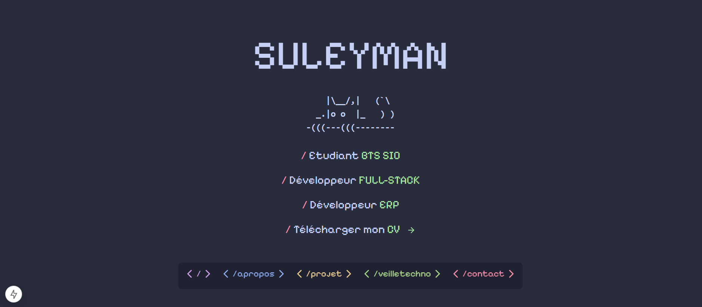
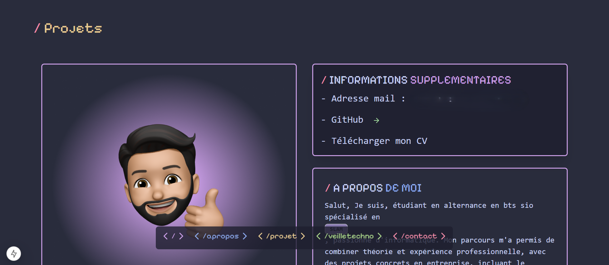
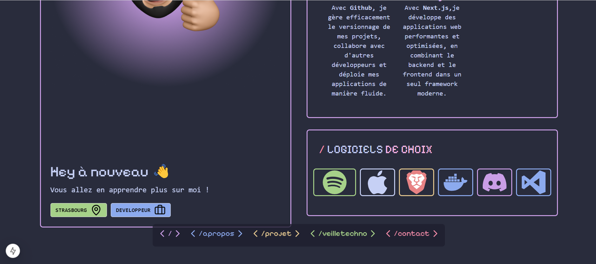
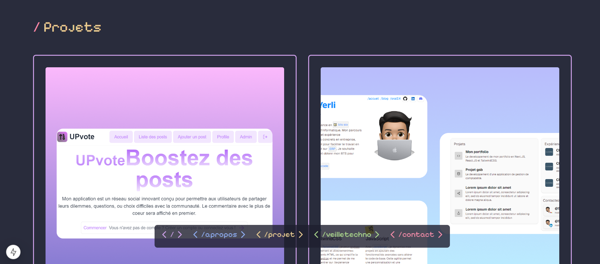
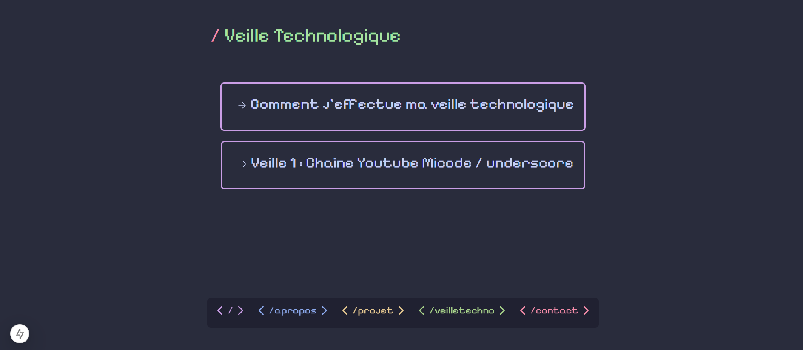
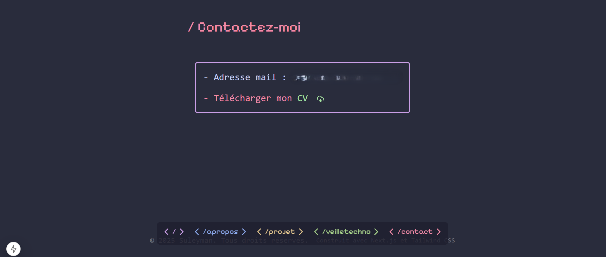

# Mes réalisations de portfolio

## Première version de mon portfolio

#### Ce portfolio a été réalisé en première année de BTS.

**Stack** : `NEXTJS, TAILWIND, SHADCN/UI, REACT`

Style simple et moderne.

## Deuxième version de mon portfolio

Style beaucoup plus travaillé avec un style gaming. Mais pas assez `"professionnel"` selon moi.
**Stack** : `NEXTJS, TAILWIND, SHADCN/UI, REACT`

Je me suis inspiré de la console de jeux vidéo.
Je n'ai pas choisi d'utiliser ce portfolio car pas assez `"professionnel"` selon moi.

Encore d'autres portfolios ont été réalisés...
