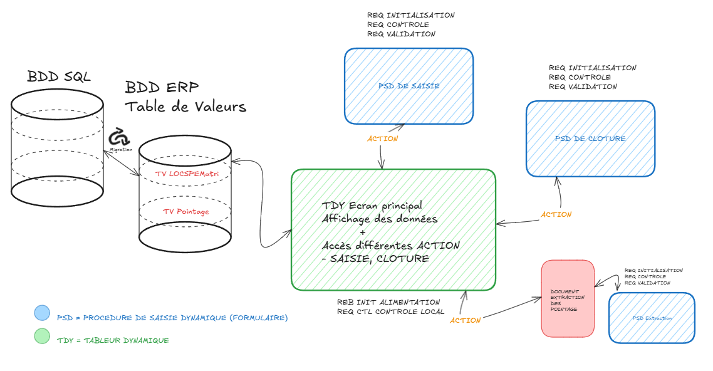
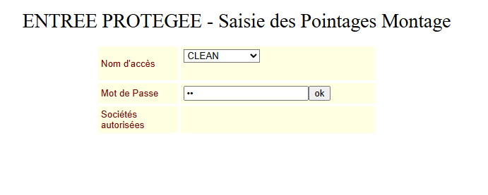
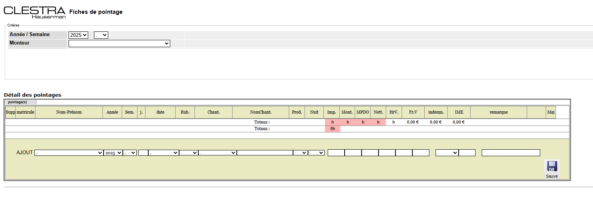
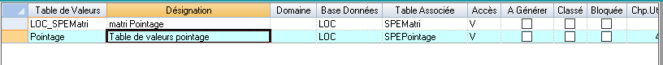
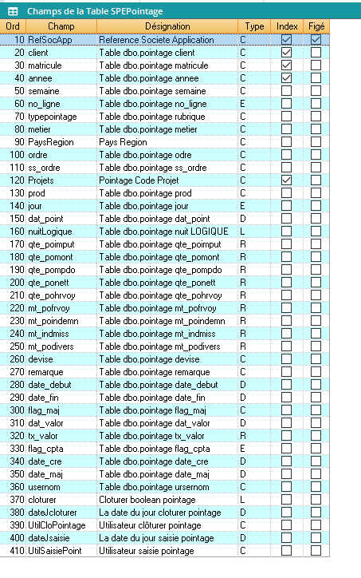
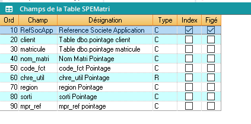
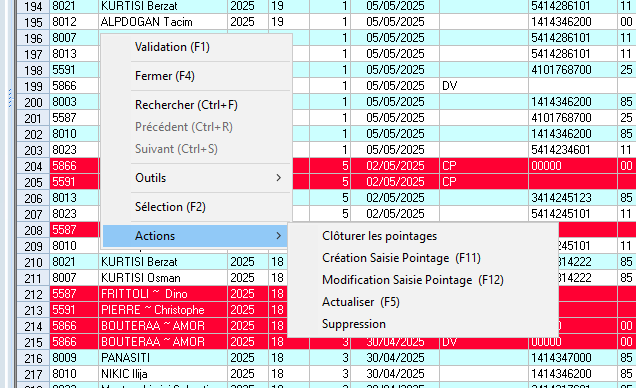
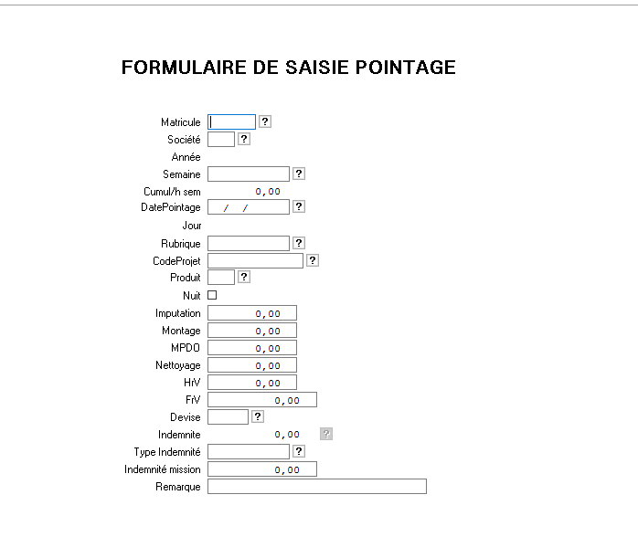
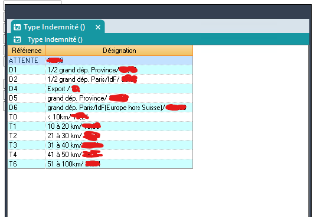
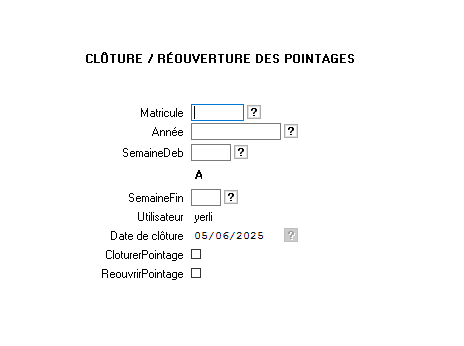

# Projet Pointage Entreprise :rocket:

 width="100"
 width="100"
 width="100"

**Compétences**

- Travailler en mode projet :heavy_check_mark:
- Mettre a disposition des utilisateurs un service informatique :heavy_check_mark:
- Organiser son développement professionnel :heavy_check_mark:
- Répondre aux incidents et aux demandes d'assistance et d'évolution :heavy_check_mark:

**Objectif : Intégrer la saisie des pointages dans l'ERP.**

L'un des projets qui m'a le plus plu et le plus complet de mon apprentissage en deuxième année.

Ma mission était d'intégrer la saisie des pointages qui se faisait à l'origine sur l'intranet dans l'ERP, dans le but de centraliser les données dans l'ERP afin de faciliter le maintien de nos différents développements.

J'ai donc dû mettre en place un plan de développement. Et je suis parti de zéro.

Dans ce compte rendu vous trouverez toutes les étapes et comment j'ai procédé pour les réaliser.

**Schéma GLOBAL du module de pointage :**



### Mon plan de développement

1. :one: Analyse des besoins auprès des utilisateurs
2. :two: Analyse du module existant de pointage
3. :three: Analyse des données et de l'historique
4. :four: Migration des données du SRVSQL vers ERP
5. :five: Développement dans l'ERP
6. :six: Phase de test
7. :seven: Mise en production
8. :eight: Formation / Documentation

### :one: Analyse des besoins

Les besoins à propos du pointage sont divisés en 3 grandes parties :

1. La saisie des pointages + visualisation (AD)
2. Clôture des pointages (RH)
3. Extraction des pointages (RH + COMPTA)

Toutes ces fonctionnalités étaient disponibles dans l'intranet avec une gestion des droits d'utilisateur.
Mais aussi différentes règles en fonction des indemnités pour les salariés français qui diffèrent des salariés suisses ou encore des règles RH à respecter (ex: pas plus de 40h semaine).

### :two: Analyse du module existant

Comment j'ai procédé ? J'ai donc analysé chacun des écrans du module dans l'intranet. Avec les différentes bases de données sur lesquelles le module allait lire ou écrire les données.
En naviguant dans les différents écrans et pages de code de l'ancien module, j'ai pu comprendre comment fonctionnait le module à l'origine.

**1er écran du module**

Cet écran gère les différentes autorisations ou fonctions sur les pointages.



Voici une partie du code. Table "dbo.securite" :

```js
if request("go")="ok" then
    if request("N") = request("NUser") Then
        chainesql= "SELECT * from securite where usernom='"&request("N") & "'"
    else
        chainesql= "SELECT * from securite where passe='"& request("pass")&"' and usernom='"&request("N") & "'"
    End if

    set objcomm1 = objcon.execute(chaineSQL)
    if (objcomm1.EOF) then
        response.redirect "erreur_acces.htm"
    else
```

**2ème écran du module**

Cet écran permet la saisie des pointages pour un matricule. J'ai donc pu déterminer 2 tables :

- La table qui stocke les pointages : "dbo.pointage"
- La table qui stocke les salariés : "dbo.matri"



L'analyse de l'ancien module m'a permis d'établir différents schémas qui m'ont permis de structurer mes idées et mon développement des futurs écrans dans l'ERP. De plus, les informations nécessaires pour migrer mes données.

### :three: & :four: Analyse des données et de l'historique / Migration des données du SRVSQL vers ERP :computer:

**A. Création des tables**

J'ai donc analysé les différentes tables et recréé la structure des tables dans **l'ERP**. `Une table dans l'ERP = Table de Valeurs ou TV`

J'ai créé 2 tables pour le pointage :

1. Table pour récupérer la saisie
2. Table pour les salariés



**Structure de la table TV Pointage**



**Structure de la table TV LOCSPEMatri**



**B. Ecriture des requêtes SQL**

La procédure formate les données directement via la requête SQL qui `génère un fichier csv` avec un séparateur ";".

Je viens parcourir mon fichier **CSV** pour alimenter mes **Tables de Valeurs** dans l'ERP.

Ma requête SQL pour construire mon csv :

```sql
SELECT
    -- Colonnes caractère formaté
    ISNULL(RIGHT('00' + RTRIM(LTRIM([client])), 2), '') AS client,
    ISNULL(LEFT(RTRIM(LTRIM([matricule])), 4), '') AS matricule,
    ISNULL(RIGHT('0000' + RTRIM(LTRIM([annee])), 4), '') AS annee,
    ISNULL(RIGHT('00' + RTRIM(LTRIM([semaine])), 2), '') AS semaine,

    -- Pas de zéro devant pour no_ligne
    ISNULL(RTRIM(LTRIM([no_ligne])), '') AS no_ligne,

    -- Toujours 2 caractères pour rubrique
    ISNULL(LEFT(RTRIM(LTRIM([rubrique])), 2), '') AS rubrique,

    ISNULL(LEFT(RTRIM(LTRIM([metier])), 1), '') AS metier,

    -- Pays + Région sur 2 caractères
    ISNULL(RIGHT('0' + RTRIM(LTRIM([pays])), 1) + RIGHT('0' + RTRIM(LTRIM([region])), 1), '') AS pays_region,

    -- Ordre sans précision donc brut
    ISNULL(RTRIM(LTRIM([ordre])), '') AS ordre,

    -- Sous-ordre toujours 2 caractères
    ISNULL(RIGHT('00' + RTRIM(LTRIM([ss_ordre])), 2), '') AS ss_ordre,

    -- CodeProjet concaténé
    ISNULL(CONCAT(
        LEFT(RTRIM(LTRIM([metier])), 1),
        RIGHT('0' + RTRIM(LTRIM([pays])), 1),
        RIGHT('0' + RTRIM(LTRIM([region])), 1),
        RTRIM(LTRIM([ordre])),
        RIGHT('00' + RTRIM(LTRIM([ss_ordre])), 2)
    ), '') AS CodeProjet,

    -- Produit toujours 2 caractères
    ISNULL(RIGHT('00' + RTRIM(LTRIM([prod])), 2), '') AS produit,

    -- Jour en numérique brut
    ISNULL(CAST([jour] AS varchar(10)), '') AS jour,

    -- Date formatée JJ/MM/AAAA
    ISNULL(CONVERT(varchar(10), [dat_point], 103), '') AS dat_point,

    -- Nuit (toujours vide)
    '' AS nuit,

    -- Quantités formatées R/8,2 ou R/10,2
    ISNULL(CAST([qte_poimput] AS decimal(8,2)), 0.00) AS qte_poimput,
    ISNULL(CAST([qte_pomont] AS decimal(8,2)), 0.00) AS qte_pomont,
    ISNULL(CAST([qte_pompdo] AS decimal(8,2)), 0.00) AS qte_pompdo,
    ISNULL(CAST([qte_ponett] AS decimal(8,2)), 0.00) AS qte_ponett,
    ISNULL(CAST([qte_pohrvoy] AS decimal(8,2)), 0.00) AS qte_pohrvoy,
    ISNULL(CAST([mt_pofrvoy] AS decimal(10,2)), 0.00) AS mt_pofrvoy,
    ISNULL(CAST([mt_poindemn] AS decimal(10,2)), 0.00) AS mt_poindemn,
    ISNULL(CAST([mt_indmiss] AS decimal(10,2)), 0.00) AS mt_indmiss,
    ISNULL(CAST([mt_podivers] AS decimal(10,2)), 0.00) AS mt_podivers,

    -- Devise et texte
    ISNULL(LEFT(RTRIM(LTRIM([devise])), 4), '') AS devise,
    ISNULL(LEFT(RTRIM(LTRIM([remarque])), 30), '') AS remarque,

    -- Dates formatées
    ISNULL(CONVERT(varchar(10), [date_debut], 103), '') AS date_debut,
    ISNULL(CONVERT(varchar(10), [date_fin], 103), '') AS date_fin,
    ISNULL(LEFT(RTRIM(LTRIM([flag_maj])), 2), '') AS flag_maj,
    ISNULL(CONVERT(varchar(10), [dat_valor], 103), '') AS dat_valor,
    ISNULL(CAST([tx_valor] AS decimal(8,2)), 0.00) AS tx_valor,
    ISNULL(CAST([flag_cpta] AS int), 0) AS flag_cpta,
    ISNULL(CONVERT(varchar(10), [date_cre], 103), '') AS date_cre,
    ISNULL(CONVERT(varchar(10), [date_maj], 103), '') AS date_maj,
    ISNULL(LEFT(RTRIM(LTRIM([usernom])), 10), '') AS usernom

FROM [CGC_2].[dbo].[pointage]
WHERE CAST([annee] AS int) > 2021
```

> **Notes :**
>
> - Formatage du CodeProjet nécessaire
> - Mise à jour des nombres
> - Mise à vide des champs et non NULL

### :five: Développement dans l'ERP :computer:

J'ai donc réalisé des schémas au fur et à mesure de mon avancée, avant de me lancer dans le développement.

À savoir que la partie authentification dans Diapason se gère différemment, donc il n'y a pas besoin de créer un formulaire pour gérer les différents droits sur le pointage dans l'ERP.

Le développement principal sera le tableur dynamique `(TDY)` qui affichera les données de la table de manière propre et organisée.
De ce même `tableur dynamique`, il sera possible de lancer des actions qui seront :

- Saisie des pointages (AD) :arrow_right: PSD de saisie des pointages
- Clôturer les pointages (RH) :arrow_right: PSD de clôture des pointages
- Suppression de ligne
- Modification de ligne



**1ère Étape** du tableur dynamique : Alimenter le `TDY`, proposer à l'utilisateur un préfiltre sur l'affichage des pointages dans le tableur. S'il ne met rien, il affiche tous les pointages.
J'ai donc décidé de créer une `Procédure de saisie dynamique` (PSD), qui se lance avant l'affichage du tableur dynamique.


Différents contrôles sont appliqués sur la `PSD`. Sur chacun des champs, une aide avec `F2` est disponible pour faciliter la saisie.

**Le code de la REB du tableur dynamique :**

```js
TRACE-ACTIVE
VLO.Societe = VCR.SocieteQ
VLO.Annees = VCR.AnneesQ
VLO.Semaines = VCR.SemainesQ
VLO.Monteur = VCR.MonteurQ
VLO.AnneeDebut = CLO.""
VLO.AnneeFin = CLO.""
VLO.SemaineDebut = CLO.""
VLO.SemaineFin = CLO.""
VLO.SocieteDebut = CLO.""
VLO.SocieteFin = CLO.""
VLO.MonteurDebut = CLO.""
VLO.MonteurFin = CLO.""
COMMENTAIRE : ""
SI VLO.Annees = CLO.""
    VLO.AnneeDebut = CLO."1900"
    VLO.AnneeFin = CLO."3000"
FIN_BLOC
SINON
    VLO.AnneeDebut = VLO.Annees
    VLO.AnneeFin = VLO.AnneeDebut
FIN_BLOC
SI VLO.Semaines = CLO.""
    VLO.SemaineDebut = CLO."00"
    VLO.SemaineFin = CLO."54"
FIN_BLOC
SINON
    VLO.SemaineDebut = VLO.Semaines
    VLO.SemaineFin = VLO.Semaines
FIN_BLOC
SI VLO.Societe = CLO.""
    VLO.SocieteDebut = CLO."00"
    VLO.SocieteFin = CLO."ZZ"
FIN_BLOC
SINON
    VLO.SocieteDebut = VLO.Societe
    VLO.SocieteFin = VLO.SocieteDebut
FIN_BLOC
SI VLO.Monteur = CLO.""
    VLO.MonteurDebut = CLO.""
    VLO.MonteurFin = CLO."ZZZZZZZZZZZZZZZZZZZZZZZZZZZZZZZZZZZZZZZZZZZZZZZZZZZZZZZZZZZZZZZZZZ"
FIN_BLOC
SINON
    VLO.MonteurDebut = VLO.Monteur
    VLO.MonteurFin = VLO.Monteur
FIN_BLOC
COMMENTAIRE : ""
VLO.LigExist = CGL.NON
POUR CHAQUE TV Pointage AVEC INDEX (IdxDefault) Pointage.annee >= VLO.AnneeDebut ET Pointage.annee <= VLO.AnneeFin ET Pointage.client >= VLO.SocieteDebut ET Pointage.client <= VLO.SocieteFin ET Pointage.matricule >= VLO.MonteurDebut ET Pointage.matricule <= VLO.MonteurFin ET Pointage.semaine >= VLO.SemaineDebut ET Pointage.semaine <= VLO.SemaineFin :
 TRACE= Pointage.matricule
 VLO.NomMatri = CLO."Matricul non définie"
 OUVRIR TV LOC_SPEMatri AVEC LOC_SPEMatri.matricule = Pointage.matricule :
 VLO.NomMatri = LOC_SPEMatri.nom_matri
 FIN_BLOC
 VLO.LigExist = CGL.OUI
 TRACE= VLO.Annees + " " + Pointage.annee + " " + VLO.Societe + " " + Pointage.client
 COMMENTAIRE : "Alimentation des données du tableur à partir des critères saisis"
 CREATION Liste LST.Pointage :
 PRENDRE pointage clôturé = Pointage.cloturer
 PRENDRE Pointage matricule = Pointage.matricule
 PRENDRE Pointage NomMatri = VLO.NomMatri
 PRENDRE Pointage annee = Pointage.annee
 PRENDRE Pointage semaine = Pointage.semaine
 PRENDRE Pointage jour = Pointage.jour
 PRENDRE Pointage dat_point = Pointage.dat_point
 PRENDRE Pointage typepointage = Pointage.typepointage
 PRENDRE Pointage Projets = Pointage.Projets
 PRENDRE Pointage prod = Pointage.prod
 PRENDRE Pointage nuitLogique = Pointage.nuitLogique
 PRENDRE Pointage qte_poimput = Pointage.qte_poimput
 PRENDRE Pointage qte_pomont = Pointage.qte_pomont
 PRENDRE Pointage qte_pompdo = Pointage.qte_pompdo
 PRENDRE Pointage qte_ponett = Pointage.qte_ponett
 PRENDRE Pointage qte_pohrvoy = Pointage.qte_pohrvoy
 PRENDRE Pointage mt_pofrvoy = Pointage.mt_pofrvoy
 PRENDRE Pointage mt_poindemn = Pointage.mt_poindemn
 PRENDRE Pointage mt_indmiss = Pointage.mt_indmiss
 PRENDRE Pointage mt_podivers = Pointage.mt_podivers
 PRENDRE Pointage devise = Pointage.devise
 PRENDRE Pointage remarque = Pointage.remarque
 PRENDRE Pointage tx_valor = Pointage.tx_valor
 PRENDRE Pointage num_ligne = Pointage.no_ligne
 FIN_BLOC
FIN_BLOC
SI VLO.LigExist FAUX
 CREATION Liste LST.Pointage :
 PRENDRE pointage clôturé = CGL.NON
 PRENDRE Pointage matricule = CLO.""
 PRENDRE Pointage NomMatri = CLO.""
 PRENDRE Pointage annee = CLO.""
 PRENDRE Pointage semaine = CLO.""
 PRENDRE Pointage jour = CLO.0
 PRENDRE Pointage dat_point = CGL.DATEVIDE
 PRENDRE Pointage typepointage = CLO.""
 PRENDRE Pointage Projets = CLO.""
 PRENDRE Pointage prod = CLO.""
 PRENDRE Pointage nuitLogique = CGL.NON
 PRENDRE Pointage qte_poimput = CLO.0
 PRENDRE Pointage qte_pomont = CLO.0
 PRENDRE Pointage qte_pompdo = CLO.0
 PRENDRE Pointage qte_ponett = CLO.0
 PRENDRE Pointage qte_pohrvoy = CLO.0
 PRENDRE Pointage mt_pofrvoy = CLO.0
 PRENDRE Pointage mt_poindemn = CLO.0
 PRENDRE Pointage mt_indmiss = CLO.0
 PRENDRE Pointage mt_podivers = CLO.0
 PRENDRE Pointage devise = CLO.""
 PRENDRE Pointage remarque = CLO.""
 PRENDRE Pointage tx_valor = CLO.0
 PRENDRE Pointage num_ligne = CLO.0
 FIN_BLOC
FIN_BLOC
POUR CHAQUE LST Pointage PAR dat_point DECROISSANT :
 CREATION Liste PointageTRIER :
 PRENDRE PointageTRIER cloturer = Pointage.cloturer
 PRENDRE PointageTRIER matricule = Pointage.matricule
 PRENDRE PointageTRIER NomMatri = Pointage.NomMatri
 PRENDRE PointageTRIER annee = Pointage.annee
 PRENDRE PointageTRIER semaine = Pointage.semaine
 PRENDRE PointageTRIER jour = Pointage.jour
 PRENDRE PointageTRIER dat_point = Pointage.dat_point
 PRENDRE PointageTRIER typepointage = Pointage.typepointage
 PRENDRE PointageTRIER Projets = Pointage.Projets
 PRENDRE PointageTRIER prod = Pointage.prod
 PRENDRE PointageTRIER nuitLogique = Pointage.nuitLogique
 PRENDRE PointageTRIER qte_poimput = Pointage.qte_poimput
 PRENDRE PointageTRIER qte_pomont = Pointage.qte_pomont
 PRENDRE PointageTRIER qte_pompdo = Pointage.qte_pompdo
 PRENDRE PointageTRIER qte_ponett = Pointage.qte_ponett
 PRENDRE PointageTRIER qte_pohrvoy = Pointage.qte_pohrvoy
 PRENDRE PointageTRIER qte_pofrvoy = Pointage.mt_pofrvoy
 PRENDRE PointageTRIER mt_poindemn = Pointage.mt_poindemn
 PRENDRE PointageTRIER mt_indmiss = Pointage.mt_indmiss
 PRENDRE PointageTRIER devise = Pointage.devise
 PRENDRE PointageTRIER Remarque = Pointage.remarque
 PRENDRE PointageTRIER num_ligne = Pointage.num_ligne
 SI PointageTRIER.cloturer VRAI
 PRENDRE PointageTRIER LIS_LigAtt = CLO."LIG-APP=ListeRouge"
 FIN_BLOC
 FIN_BLOC
FIN_BLOC

```

**Un exemple de code sur la requête de contrôle `LOCAL` de la PSD de filtre.**

```js
VLO.Variable = SCR.CdeSCCVar
VLO.Valeur = SCR.CdeSCCVal
VLO.Evenement = SCR.CdeSCCEvt
COMMENTAIRE : "*********************************Gestion champ Monteurs*********************************"
SI VLO.Variable = CLO."Monteur"
 SI VLO.Evenement = CLO."AID"
 PURGE-SELINF VLO.Variable
 COMMENTAIRE : "*********************************Filtre monteurs associés à la société sélectionnée*********************************"
 POUR CHAQUE TV LOC_SPEMatri AVEC LOC_SPEMatri.client = VSD.Societe :
 CRE-SELINF :
 INIT SDH.LisInfRef = VLO.Variable
 INIT SDH.LisInfInf = LOC_SPEMatri.matricule
 INIT SDH.LisInfDes = LOC_SPEMatri.nom_matri
 INIT SDH.LisInfCom = LOC_SPEMatri.client
 FIN_BLOC
 FIN_BLOC
 FIN_BLOC
FIN_BLOC
COMMENTAIRE : "Toujours renseigner le champ Societe"
SI VLO.Variable = CLO."Monteur"
 SI VLO.Evenement = CLO."AID"
 SI VSD.Societe = CLO.""
 LC-Erreur = CLO."Veuillez renseigner le champ Société avant de saisir Monteur."
 FIN_BLOC
 FIN_BLOC
FIN_BLOC
```

**Voici la `PSD de saisie des pointages`**


Plusiseurs **contrôle** et **aide** sur les champs ont était codé.

Prenons un exemple sur cette PSD, **les indemnités**.
Nous avons des salariés `Suisse` et `Français`, il ne possèdent donc pas les mêmes indemnités.

Je devais donc sur le champ `Type Indemnité` proposer uniquement en fonction de la `Société` et le `Matricule` et de la `Devise` le type d'indemnité correspondant au pays.

Voici l'exemple du code qui permet de faire cela:
Ce code est du contrôle `LOCAL` il doit donc se situer dans la **REQUETE DE CONTROLE LOCAL** de la PSD en question.
**Exemple d'aide de saisie**

```js
COMMENTAIRE : "AID INDEMNITE ExpParam pour EUR et si société = suisse = 04"
SI VLO.Variable = CLO."TIndemnite"
 VLO.NomGroupe = CLO."POINTAGE"
 VLO.NomSG = CLO.""
 VLO.NomRef = VSD.Devise
 COMMENTAIRE : "CAS 1:"
 SI VSD.Societe = CLO."2F" ET VSD.Devise = CLO."EUR"
 VLO.NomSG = CLO."Indemfr"
 FIN_BLOC
 COMMENTAIRE : "CAS 2:"
 SI VSD.Societe = CLO."2F" ET VSD.Devise = CLO."CHF"
 VLO.NomSG = CLO."Indemfr"
 FIN_BLOC
 COMMENTAIRE : "CAS 3:"
 SI VSD.Societe = CLO."04" ET VSD.Devise = CLO."CHF"
 VLO.NomSG = CLO."Indemsuisse"
 FIN_BLOC
 TRACE= VSD.Societe + " " + VSD.Devise + " " + VLO.Evenement + " " + VLO.NomSG + " " + VLO.NomRef + " " + VSD.TIndemnite + " " + CLO."SALUT"
 SI VLO.Evenement = CLO."CTL"
 TRACE= VSD.Societe + " " + VSD.Devise + " " + VLO.Evenement + " " + VLO.NomSG + " " + VLO.NomRef + " " + VSD.TIndemnite + " " + CLO."SALUT"
 SI VSD.TIndemnite EXISTE ET <> ""
 OUVRIR TV ExpParam AVEC INDEX (IdxDefault) ExpParam.SPEGroupe = CLO."POINTAGE" ET ExpParam.SPESGroupe = VLO.NomSG ET ExpParam.SPEref = VLO.NomRef ET ExpParam.SPEDes = VSD.TIndemnite :
 INIT VSD.Indemnite = ExpParam.SPEChampNum
 FIN_BLOC
 FIN_BLOC
 FIN_BLOC
 SI VLO.Evenement = CLO."AID"
 PURGE-SELINF VLO.Variable
 POUR CHAQUE TV ExpParam AVEC ExpParam.SPEGroupe = VLO.NomGroupe ET ExpParam.SPESGroupe = VLO.NomSG ET ExpParam.SPEref = VLO.NomRef :
 CRE-SELINF :
 INIT SDH.LisInfRef = VLO.Variable
 INIT SDH.LisInfInf = ExpParam.SPEDes
 INIT SDH.LisInfDes = ExpParam.SPEChampCar
 FIN_BLOC
 FIN_BLOC
 INIT-LISTE-AIDE VLO.Variable
 FIN_BLOC
FIN_BLOC
```

**Résultat du code lorsque que l'utilisateur appuie sur F2 :**
Indemnité pour un salarié Français:


**Voici la `PSD de clôture des pointages`**
C'est une `PSD` assez simple on demande à l'utilisateur de saisir `SEMAINE A` vers `SEMAINE B`. La période saisie sera alors clôturer. Un booléen qui à l'origine est à `FALSE` passe à `TRUE`, les pointages clôturer son alors afficher en rouge dans le `TDY`.


### :seven: Mise en production

Mise en prod assez simple passage de l'environnement de `RECETTE` vers l'environnement de production.`PROD` fonctionnalité intégré dans l'ERP.

**CONCLUSION**: Le module de pointage est complet et reprends toutes les fonctionnalités précédente plus certaines amélioration et optimisation. La saisie a été rendue plus fluide et plus rapide d'après les utilisateurs ! :blush:
