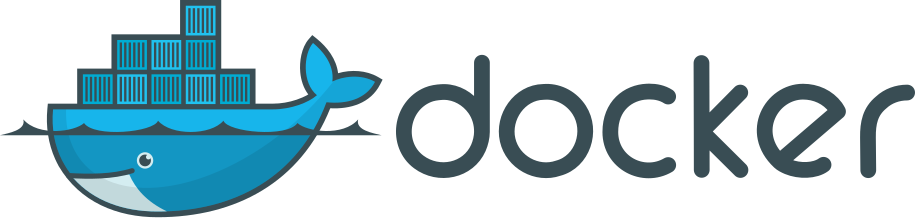
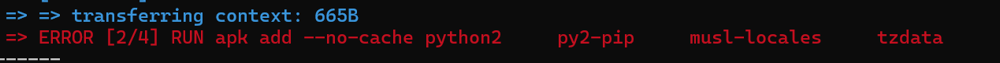
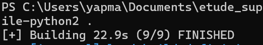
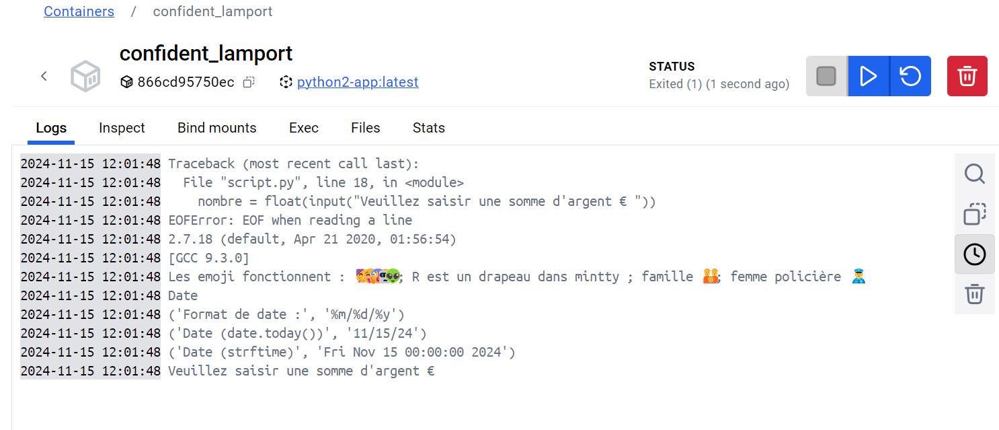
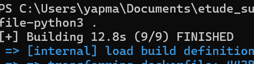
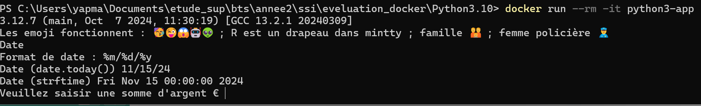

# Docker et Docker-compose



## PARTIE I : DOCKERFILE

### 1) DOCKER

#### a) Qu'est-ce qu'un fichier Dockerfile ?

Un Dockerfile est un fichier texte qui contient une série d'instructions permettant de construire automatiquement une image Docker. Il définit l'environnement et la configuration nécessaires pour exécuter une application dans un conteneur.

#### b) Instructions principales Docker

- **FROM** : Spécifie l'image de base à utiliser comme point de départ. C'est la première instruction obligatoire dans un Dockerfile.

- **RUN** : Exécute des commandes dans le conteneur pendant la phase de construction de l'image. Utile pour installer des paquets, des dépendances ou effectuer des configurations.

- **WORKDIR** : Définit le répertoire de travail courant pour les instructions suivantes (RUN, CMD, ENTRYPOINT, COPY, ADD). Si le répertoire n'existe pas, il sera créé.

- **COPY** : Copie des fichiers ou répertoires depuis le système hôte vers le système de fichiers de l'image.

- **CMD** : Spécifie la commande par défaut à exécuter lors du démarrage du conteneur. Peut être remplacée par des arguments en ligne de commande.

- **ENTRYPOINT** : Définit le point d'entrée principal du conteneur. Configure l'exécutable principal qui sera toujours exécuté au démarrage du conteneur.

### 2) DOCKER ET PYTHON

Ce que j'ai fait :

- Création des Dockerfile pour Python 2.7
- copie du script Python
- créer un dossier qui contient le dockerfile et le script Python(2.7)
- créer un dossier qui contient le dockerfile et le script Python(3.10)
- Construire l'image Docker
- Exécuter le conteneur

#### Analyse du script Python

Le script Python fourni nécessite :

- Support des locales françaises (fr_FR.UTF-8)
- Support UTF-8 pour les emoji
- Packages Python : sys, locale, datetime
- Interface interactive pour la saisie utilisateur

#### Solution proposée

1. **Execution 2.7**

Pour Python 2.7 :

Dificulté :

- Python 2.7 n'est plus maintenu, il n'est pas disponible dans les références officielles d'Alpine Linux.
  Les paquets python2 et py2-pip ne sont plus disponibles dans les dépôts Alpine Linux récents.
  Pour résoudre ce problème, j'utiliser une version plus ancienne d'Alpine qui supporte encore Python 2.7.
  En utilisant alpine:3.12

  

- Télécharger le fichier get-pip.py pour installer pip
  En utilisant wget pour télécharger le fichier get-pip.py qui install pip pour pyhton 2.7.
  Et nous supprimer le fichier get-pip.py après l'installation de pip. pour éviter les erreurs de dépendances.

  Après c'est deux modifications, l'image est construite correctement.
  

  Run de l'image :
  

2. **Execution 3.10**

Dockerfile :

```bash
FROM alpine:3.12

# Installation des dépendances
RUN apk add --no-cache python2 \
    musl-locales \
    tzdata \
    && wget https://bootstrap.pypa.io/pip/2.7/get-pip.py \
    && python2 get-pip.py \
    && rm get-pip.py

# Configuration des locales
ENV LANG=fr_FR.UTF-8
ENV LANGUAGE=fr_FR.UTF-8
ENV LC_ALL=fr_FR.UTF-8

# Création du répertoire de travail
WORKDIR /app

# Copie du script
COPY script.py .

# Commande d'exécution
ENTRYPOINT ["python2", "script.py"]
```

Pour Python 3.10 :

build:

```
docker build -t python3-app -f Dockerfile-python3 .
```

Le build c'est bien passé.


Run:

```
docker run python3-app
```



Dockerfile :

```bash
FROM alpine:latest

# Installation des dépendances
RUN apk add --no-cache python3 \
    py3-pip \
    musl-locales \
    tzdata

# Configuration des locales
ENV LANG=fr_FR.UTF-8
ENV LANGUAGE=fr_FR.UTF-8
ENV LC_ALL=fr_FR.UTF-8

# Création du répertoire de travail
WORKDIR /app

# Copie du script
COPY script.py .

# Commande d'exécution
ENTRYPOINT ["python3", "script.py"]
```

## PARTIE II : DOCKER-COMPOSE

1. **Documentation**

- **Volumes dans Docker-Compose** :
  Signification : Les volumes permettent de persister des données en dehors du cycle de vie des conteneurs. Ils sont utilisés pour stocker des données qui doivent être conservées même si le conteneur est supprimé.
  Types de volumes :

  - Volumes nommés : Gérés par Docker, ils sont créés et gérés automatiquement.
  - Bind mounts : Liens directs vers le système de fichiers de l'hôte.

- **Networks dans Docker-Compose** :
  Signification : Les réseaux permettent aux conteneurs de communiquer entre eux. Ils peuvent être configurés pour isoler les conteneurs ou les connecter à d'autres services.
  Types de réseaux :
  Bridge : Réseau par défaut pour les conteneurs sur un hôte unique.
  Host : Utilise le réseau de l'hôte directement.

  - Overlay : Utilisé pour les services Docker Swarm.

- **Commandes Docker-Compose** :
  - docker-compose --build : Reconstruit les images avant de démarrer les conteneurs.
  - docker-compose up : Démarre les services définis dans le fichier docker-compose.yml.
