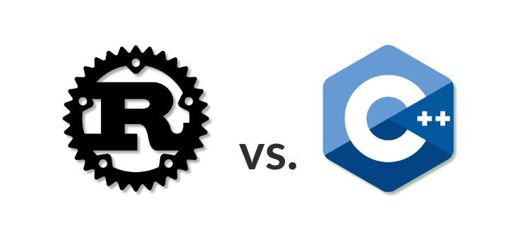
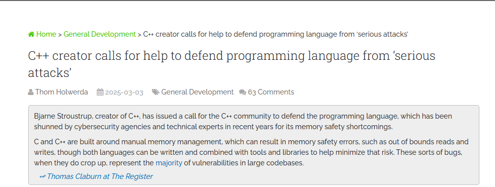
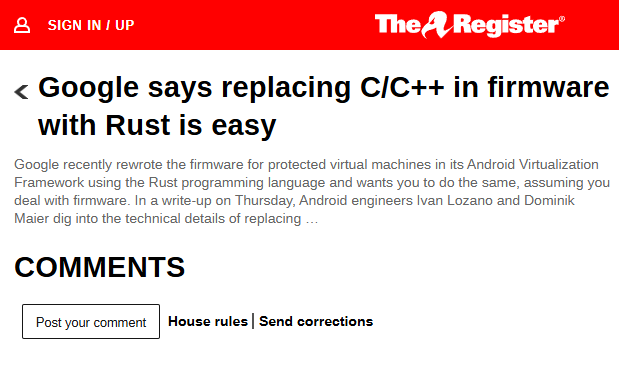
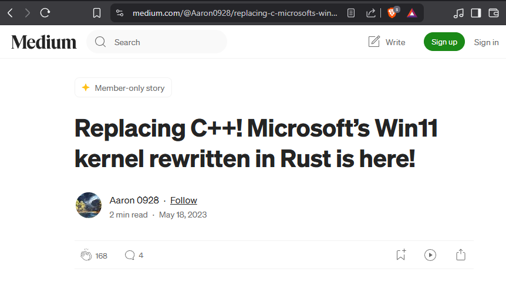
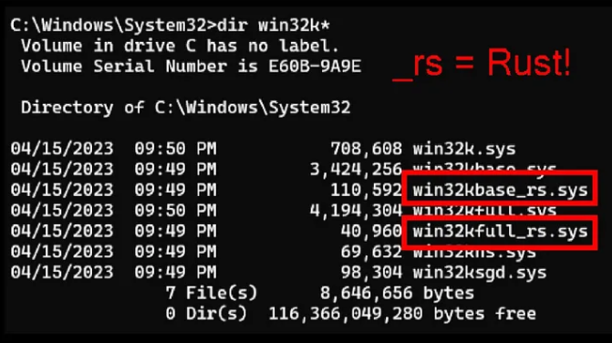

# Rust vs C++

## Introduction

Depuis quelques années, C++ traverse une période agitée. De plus en plus de pression s'exerce sur les développeurs pour qu'ils évitent d'utiliser C++ dans leurs nouveaux projets, principalement à cause de ses failles de sécurité liées à la gestion mémoire.

`Bjarne Stroustrup, créateur de C++, a lancé un appel à la communauté C++ pour défendre le langage de programmation, qui a été boudé par les agences de cybersécurité, les experts techniques, les agences gouvernementales américaines et de nombreuses grandes entreprises ces dernières années en raison de ses lacunes en matière de sécurité de la mémoire.`

source : <https://www.osnews.com/story/141836/c-creator-calls-for-help-to-defend-programming-language-from-serious-attacks/>

## La concurrence des langages plus sûrs

Pourquoi continuer à utiliser C ou C++ alors que l'alternative comme **Rust**, offre une meilleure sécurité mémoire ? Cette tendance pousse même Bjarne Stroustrup, le créateur de C++, à lancer un appel pour défendre son langage face à des critiques qu'il juge sérieuses.

Mais ces critiques ne concernent pas uniquement les vulnérabilités classiques comme les erreurs de dépassement de tampon ou d'accès hors limites. Ce qui inquiète surtout, c'est que des agences gouvernementales et des experts en cybersécurité écartent désormais C++ à cause de ces risques de sécurité, au profit de langages considérés comme plus sûrs.

## Les géants technologiques prennent position

**Microsoft**, par exemple, a commencé à réécrire certaines parties de Windows en Rust après avoir constaté que _70 % des vulnérabilités de Windows_ provenaient d'erreurs de gestion mémoire en C ou C++. **Google** suit la même voie en remplaçant des composants critiques d'Android par du Rust, et même le noyau Linux explore cette possibilité.

Fait intéressant : **Linus Torvalds**, créateur de Linux, a toujours rejeté C++ pour le noyau, estimant qu'il est trop complexe et lourd. Il est clair que la question de la sécurité mémoire est désormais une priorité, en particulier dans les secteurs sensibles.

source : <https://forums.theregister.com/forum/all/2024/09/06/google_rust_c_code_language/>

source : <https://medium.com/@Aaron0928/replacing-c-microsofts-win11-kernel-rewritten-in-rust-is-here-3006a90d1f11>

source : <https://medium.com/@Aaron0928/replacing-c-microsofts-win11-kernel-rewritten-in-rust-is-here-3006a90d1f11>

## C++ est-il vraiment dangereux ?

Selon Stroustrup, C++ n'est pas fondamentalement dangereux. Si un développeur sait gérer manuellement la mémoire, il peut éviter les problèmes. Mais dans la pratique, la complexité de cette gestion manuelle conduit souvent à des erreurs, surtout pour les moins expérimentés.

## La proposition des C++ Profiles

Pour répondre à ce défi, Stroustrup propose une initiative : les **C++ Profiles**. Ces profils seraient des ensembles de règles ou des modes de sécurité intégrés au langage pour encourager ou imposer une gestion mémoire plus stricte.

Bien que cette proposition en soit encore au stade de l'idée, elle viserait probablement à :

- Limiter ou interdire certaines pratiques risquées.
- Imposer l'utilisation de pointeurs intelligents plutôt que des pointeurs bruts.
- Restreindre certaines fonctionnalités du langage connues pour introduire des vulnérabilités.

Cependant, cette approche soulève des inquiétudes : cela risque-t-il de réduire la performance, qui est l'une des principales forces de C++ ?

## Le dilemme de la performance et de la flexibilité

C++ est très prisé pour des applications nécessitant des performances extrêmes, comme les moteurs de jeux vidéo ou les programmes financiers de haute fréquence. Sa flexibilité et son contrôle bas niveau permettent une optimisation très fine.

L'introduction des profils risque de limiter cette flexibilité, et peut-être même de freiner la performance, ce qui pourrait nuire à l'adoption de cette initiative.

## Un changement progressif, pas une révolution

Même si ces profils sont adoptés, cela n'aura pas d'effet rétroactif sur les millions de lignes de code C++ déjà en production. Les développeurs devront donc appliquer ces nouvelles règles manuellement dans leurs projets existants, un travail colossal.

Reste aussi la question de la réticence culturelle : les développeurs C++ sont souvent réfractaires au changement et sceptiques vis-à-vis des langages plus récents comme Rust ou Go. Pour eux, la solution est souvent d'améliorer la qualité du code plutôt que de changer de langage ou d'adopter de nouvelles règles.

## Conclusion

C++ ne va pas disparaître. Il reste incontournable, surtout dans les systèmes critiques où sa performance est irremplaçable. La vraie question est de savoir combien de nouveaux projets choisiront encore C++ face aux alternatives.

Les **C++ Profiles** semblent être une solution intermédiaire prometteuse : sécuriser le code sans devoir tout réécrire, mais il faudra trouver le bon équilibre pour ne pas sacrifier les atouts majeurs du langage.
