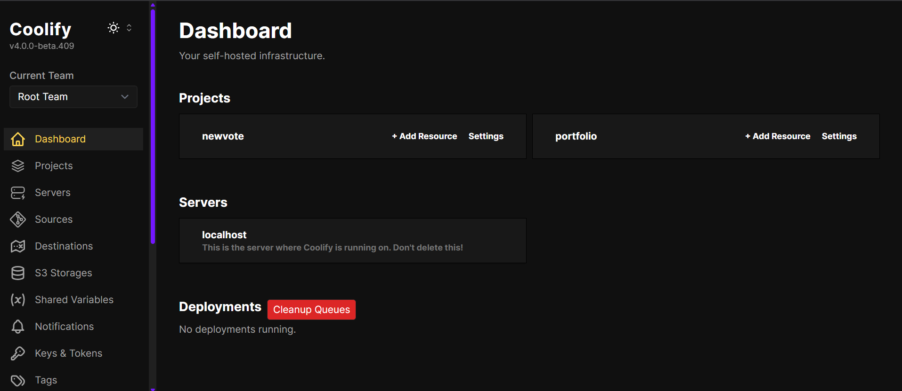

# Coolify — Une solution simple et moderne pour déployer ses projets


## Introduction

Lorsqu’on travaille sur des projets web, que ce soit un portfolio ou une application, une question revient toujours : **comment déployer facilement son application sans se prendre la tête avec des configurations serveur complexes ?**

C’est exactement la problématique que j’ai rencontrée dans le cadre de mon projet BTS et c’est là que j’ai découvert **Coolify**, une alternative open-source aux solutions comme **Heroku** ou **Vercel**.

Dans cette veille, je vous propose de découvrir **Coolify**, ses avantages, son fonctionnement et pourquoi il mérite d’être connu.

---

## Coolify, c’est quoi exactement ?

Coolify est une plateforme de déploiement auto-hébergée qui permet de gérer et de déployer des applications modernes en toute simplicité, que ce soit :

- des sites statiques (comme ceux générés par Hugo, Astro ou Next.js),
- des applications backend (Node.js, Laravel, Django, Flask, etc.),
- ou même des services Docker et des bases de données.

Le tout se fait via une interface web très claire, sans avoir à taper des commandes compliquées ou à écrire des scripts DevOps.  
On pourrait dire que **Coolify simplifie l’auto-hébergement**, tout en gardant un contrôle total sur sa machine.

---

## Pourquoi j’ai choisi d’utiliser Coolify ?

La principale raison, c’est que je cherchais une solution simple, gratuite, et open-source, capable de déployer mon **portfolio** et mon **projet BTS** sans dépendre d’un service cloud payant ou limité.

Coolify m’a séduit par :

- sa facilité d’installation,
- son interface web intuitive,
- la possibilité de gérer plusieurs applications et bases de données,
- son intégration directe avec GitHub pour des déploiements automatiques,
- et le fait qu'il soit auto-hébergé, donc mes données restent sur mon serveur.



---

## Comment fonctionne Coolify ?

Le fonctionnement de Coolify repose sur **Docker**. Une fois installé, chaque application, chaque base de données et chaque service sont isolés dans des containers Docker. Cela permet de garantir la stabilité, la sécurité et la simplicité du déploiement.

En résumé :

1. On connecte son dépôt Git (GitHub, GitLab, Bitbucket).
2. On configure les variables d'environnement (comme une URL, une clé API, etc.).
3. Lorsqu'on fait un `git push`, Coolify détecte la mise à jour et déploie automatiquement la nouvelle version.
4. Tout est consultable et contrôlable via une interface web claire : logs, certificats SSL, bases de données, monitoring.

---

## Comment installer Coolify ?

Ce qui m’a impressionné avec Coolify, c’est sa simplicité d’installation.

Il suffit d’avoir une machine Linux (personnellement j’ai utilisé un VPS Hostinger), Docker et docker-compose d’installés, puis d’exécuter ces quelques commandes :

```bash
git clone https://github.com/coollabsio/coolify.git
cd coolify
docker compose up -d
```

En quelques minutes, l'interface est accessible via :
`http://<adresse-ip>:8000`

## Pourquoi c’est intéressant dans le cadre d’une veille technologique ?

Aujourd’hui, le déploiement d’applications web évolue vers des solutions automatisées, simples et accessibles, sans sacrifier le contrôle et la sécurité. Coolify suit cette tendance :

- Il permet une gestion plus éthique et transparente des projets, en évitant le verrouillage propriétaire.

- Il favorise l'apprentissage de Docker et des bonnes pratiques DevOps, sans être un expert système.

- Il offre une alternative sérieuse et gratuite pour déployer des projets personnels ou professionnels.

## Conclusion

Coolify est une solution que je recommande à toute personne qui souhaite déployer ses projets sans se perdre dans la complexité des serveurs, tout en conservant une liberté totale.
Dans mon cas, il a parfaitement répondu à mes besoins pour héberger mon portfolio et mon projet BTS, tout en me donnant l’occasion d’approfondir mes compétences sur Docker, Git et l’auto-hébergement.

À mes yeux, c’est une belle alternative aux géants du cloud, idéale pour un étudiant, un indépendant ou une petite équipe.

## Sources

Documentation officielle : <https://coolify.io/docs>

GitHub officiel : <https://github.com/coollabsio/coolify>

Article de présentation : <https://dev.to/kenza/coolify-deployer-ses-applications-sur-son-propre-serveur-41eg>

Comparatif Heroku vs Coolify : <https://www.geek-coder.com/deployer-coolify/>
